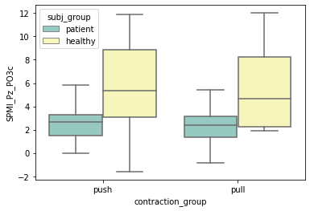

# This notebook aims to provide statistical functions, build dataFrame, and perform statistical analyses. The conditions/groups are push/pull+ healthy/lf-patients/hf-patients/sham-patients + before/after-TMS The hypotheses tested are:
- difference between healthy subjects and patients (includng lf/hf/sham-TMS) in push/pull epochs()
- the regression between CMMN properties (including components-SPMIs and graph properties) and FMA
- clustering analyses on CMMN properties (UE-brunnstrom clusters)
- ANOVA and MANOVA and post-hoc analyses (details are missed)

# Section1: fcs & load basic epoch info


```python
from itertools import count
import matplotlib,numpy as np
import matplotlib.cm as cm

class EEGChannel:
    '''innitilized by info chs'''
    _ids = count(0)
    
    def __init__(self, x, y,name="None"):
        self.id = next(self._ids)
        self.x = x
        self.y = y
        self.name = name
    def plot(self,ax,center):
        circle = plt.Circle((center[0]+self.x, center[1]+self.y), radius=0.2,fill = True)
        ax.add_patch(circle)
        label = ax.annotate(self.name, xy=(center[0]+self.x, center[1]+self.y), fontsize=18, ha="center")
        return ax 

    
class EMGChannel:
    '''with polar coordinates as inputs'''
    
    _ids = count(0)
    
    def __init__(self, rho, phi,name="None"):
        self.id = next(self._ids)
        self.rho = rho
        self.phi = phi
        self.name = name
        self.x = rho * np.cos(phi/180*np.pi)
        self.y = rho * np.sin(phi/180*np.pi)
        
    def plot(self,ax,center):
        circle = plt.Circle((center[0]+self.x, center[1]+self.y), radius=0.2,fill = True)
        ax.add_patch(circle)
        label = ax.annotate(self.name, xy=(center[0]+self.x, center[1]+self.y), fontsize=18, ha="center")
        return ax        
    
    def cartesianC(self):
        return(self.x, self.y)
    
    def polarC(self):
        return(self.rho,self.phi)

# EMG Topograph_basis
def plotTopoEMG(EMGs,ax,center=[7,0]):
    for i in range(2):
        circle = plt.Circle((center[0],center[1]), 2*(i+1),fill = False)
        ax.add_artist(circle)
    for EMG in EMGs:
        ax = EMG.plot(ax,center)
    return ax

def plotTopoEEG(EEGs,ax,center=[-5,0],radius=6):
    circle = plt.Circle((center[0],center[1]),radius,fill = False)
    ax.plot()
    ax.plot([center[0]-0.5,center[0]],[radius+center[1],radius+center[1]+1])
    ax.plot([center[0]+0.5,center[0]],[radius+center[1],radius+center[1]+1])
    ax.add_artist(circle)
    for EEG in EEGs:
        ax = EEG.plot(ax,center)
    return ax    
    
def c_map(data):
    '''
    data should be numpy array (adj_m, for example)
    '''
    minima = np.min(data[np.nonzero(data)])
    maxima = np.max(data)
    if minima==maxima:
        minima-=0.2
        maxima+=0.2
    norm = matplotlib.colors.Normalize(vmin=minima,vmax=maxima,clip=True)
#     mapper = cm.ScalarMappable(norm=norm,cmap=cm.viridis)
    mapper = cm.ScalarMappable(norm=norm,cmap="bwr")
    return mapper

def c_map_bwr(data):
    '''
    data should be numpy array (adj_m, for example)
    '''
    minima = np.min(data[np.nonzero(data)])
    maxima = np.max(data)
    if minima==maxima:
        minima-=0.2
        maxima+=0.2
    boundary = (np.abs(maxima)+np.abs(minima))/2
    norm = matplotlib.colors.Normalize(vmin=-boundary,vmax=boundary,clip=True)
#     mapper = cm.ScalarMappable(norm=norm,cmap=cm.viridis)
    mapper = cm.ScalarMappable(norm=norm,cmap="bwr")
    return mapper

def graph_plot(adj_m,fig,ax,ignore_zero=True,center_EEG=[-5,0],center_EMG=[7,0]):
    mapper = c_map(adj_m)
    if ignore_zero==True:
        for ix,iy in np.ndindex(adj_m.shape):
            if -0.1<adj_m[ix,iy]<0.1:
                pass
            else:
                if ix>31:
                    if iy>31:
                        ax.plot([EMGs[ix-32].x+center_EMG[0], EMGs[iy-32].x+center_EMG[0]],
                                [EMGs[ix-32].y+center_EMG[1], EMGs[iy-32].y+center_EMG[1]],
                                color = mapper.to_rgba(adj_m[ix,iy]))
                    else:
                        ax.plot([EMGs[ix-32].x+center_EMG[0], EEGs[iy].x+center_EEG[0]],
                                [EMGs[ix-32].y+center_EMG[1], EEGs[iy].y+center_EEG[1]],
                               color = mapper.to_rgba(adj_m[ix,iy]))
                else:
                    if iy>31:
                        ax.plot([EEGs[ix].x+center_EEG[0], EMGs[iy-32].x+center_EMG[0]],
                                [EEGs[ix].y+center_EEG[1], EMGs[iy-32].y+center_EMG[1]],
                               color = mapper.to_rgba(adj_m[ix,iy]))
                    else:
                        ax.plot([EEGs[ix].x+center_EEG[0], EEGs[iy].x+center_EEG[0]],
                                [EEGs[ix].y+center_EEG[1], EEGs[iy].y+center_EEG[1]],
                               color = mapper.to_rgba(adj_m[ix,iy]))
    fig.colorbar(mapper,ax=ax)
    return fig,ax

def graph_plot_fixMapper(adj_m,adj_m_fix,fig,ax,ignore_zero=True,center_EEG=[-5,0],center_EMG=[7,0]):
    # the colorbar of the output plot only depends on adj_m_fix
    mapper = c_map_bwr(adj_m_fix)
    if ignore_zero==True:
        for ix,iy in np.ndindex(adj_m.shape):
            if -0.1<adj_m[ix,iy]<0.1:
                pass
            else:
                if ix>31:
                    if iy>31:
                        ax.plot([EMGs[ix-32].x+center_EMG[0], EMGs[iy-32].x+center_EMG[0]],
                                [EMGs[ix-32].y+center_EMG[1], EMGs[iy-32].y+center_EMG[1]],
                                color = mapper.to_rgba(adj_m[ix,iy]))
                    else:
                        ax.plot([EMGs[ix-32].x+center_EMG[0], EEGs[iy].x+center_EEG[0]],
                                [EMGs[ix-32].y+center_EMG[1], EEGs[iy].y+center_EEG[1]],
                               color = mapper.to_rgba(adj_m[ix,iy]))
                else:
                    if iy>31:
                        ax.plot([EEGs[ix].x+center_EEG[0], EMGs[iy-32].x+center_EMG[0]],
                                [EEGs[ix].y+center_EEG[1], EMGs[iy-32].y+center_EMG[1]],
                               color = mapper.to_rgba(adj_m[ix,iy]))
                    else:
                        ax.plot([EEGs[ix].x+center_EEG[0], EEGs[iy].x+center_EEG[0]],
                                [EEGs[ix].y+center_EEG[1], EEGs[iy].y+center_EEG[1]],
                               color = mapper.to_rgba(adj_m[ix,iy]))
    fig.colorbar(mapper,ax=ax)
    return fig,ax

# setup
import pandas as pd
import numpy as np
import matplotlib.pyplot as plt
import seaborn as sns
import scipy
from statannot import add_stat_annotation
from itertools import count
import os, mne, warnings
warnings.filterwarnings("ignore", category=DeprecationWarning)


# calculate the Cohen's d between two samples
from numpy.random import randn
from numpy.random import seed
from numpy import mean
from numpy import var
from math import sqrt

# function to calculate Cohen's d for independent samples
def cohend(d1, d2):
    n1, n2 = len(d1), len(d2)
    s1, s2 = var(d1, ddof=1), var(d2, ddof=1)
    s = sqrt(((n1 - 1) * s1 + (n2 - 1) * s2) / (n1 + n2 - 2))
    u1, u2 = mean(d1), mean(d2)
    return (u1 - u2) / s


    
chs_list_preImage_lParetic = ['Fp1','AF3','F3','F7','FC1','FC5','C3','T7','CP1','CP5','P3','P7','PO3','O1',
                              'Fz','Cz','Pz','Oz',
                   'Fp2','AF4','F4','F8','FC2','FC6','C4','T8','CP2','CP6','P4','P8','PO4','O2',
                             'emg1','emg2','emg3','emg4','emg5','emg6','emg7','emg8']

chs_list_preImage_rParetic = ['Fp2','AF4','F4','F8','FC2','FC6','C4','T8','CP2','CP6','P4','P8','PO4','O2',
                              'Fz','Cz','Pz','Oz',
                   'Fp1','AF3','F3','F7','FC1','FC5','C3','T7','CP1','CP5','P3','P7','PO3','O1',
                             'emg1','emg2','emg3','emg4','emg5','emg6','emg7','emg8']

chs_list_image = ['Fp1i','AF3i','F3i','F7i','FC1i','FC5i','C3i','T7i','CP1i','CP5i','P3i','P7i','PO3i','O1i',
                      'Fz','Cz','Pz','Oz',
                       'Fp1c','AF3c','F3c','F7c','FC1c','FC5c','C3c','T8c','CP1c','CP5c','P3c','P7c','PO3c','O1c',
                      'emg1','emg2','emg3','emg4','emg5','emg6','emg7','emg8']


################## Dataset Loading ##################
data_dir = 'E:/masterSJTU/MultiEEGEMG_stroke/'
iVC_results_dir = os.path.join(data_dir,'results','iVC')
if not os.path.exists(iVC_results_dir):
    os.makedirs(iVC_results_dir)
# data_dir = 'E:/important file/Projects/CM-graph/sample_data' #PC dir
subj_idx = '15'
contraction_type = 'iMC'
session_idx = 's01'
subjInfo_fName = os.path.join(data_dir,'subj_info.txt')
subjInfo = pd.read_csv(subjInfo_fName, skiprows=0,
                       sep = ',',engine = 'python')
affected_h = subjInfo[subjInfo['subj_idx']==int(subj_idx)]['affected_h'].values[0]
epochs_hybrid_dir = os.path.join(data_dir,'subj'+subj_idx,'epochs_hybrid')
epochs_hybrid_fName = os.path.join(data_dir,'subj'+subj_idx,'epochs_hybrid',
                                      'subj'+subj_idx+'_'+contraction_type+'_'+session_idx+'_hybrid_epo.fif')
epochs_hybrid = mne.read_epochs(epochs_hybrid_fName,preload=True)

EMGs=[EMGChannel(2,150,'emg1'),EMGChannel(2,170,'emg2'),EMGChannel(2, 240,'emg3'),EMGChannel(2,350,'emg4'),
      EMGChannel(2, 80,'emg5'),EMGChannel(4,140,'emg6'),EMGChannel(4, 310,'emg7'),
      EMGChannel(4,90,'emg8')]

EEGs = [EEGChannel(x=epochs_hybrid.info['chs'][epochs_hybrid.info['ch_names'].index(chs_list_preImage_rParetic[chs_list_image.index(ch)])]['loc'][0]*50,
           y=epochs_hybrid.info['chs'][epochs_hybrid.info['ch_names'].index(chs_list_preImage_rParetic[chs_list_image.index(ch)])]['loc'][1]*50,
           name=ch) for ch in chs_list_image[:32]]  
```

    Reading E:/masterSJTU/MultiEEGEMG_stroke/subj15\epochs_hybrid\subj15_iMC_s01_hybrid_epo.fif ...
        Found the data of interest:
            t =       0.00 ...    2000.00 ms
            0 CTF compensation matrices available
    45 matching events found
    Applying baseline correction (mode: mean)
    Not setting metadata
    0 projection items activated
    

# Section2: df construction


```python
import os, pandas as pd, numpy as np
# definition
n_chs = 40
cV_ratio = 5
n_SPMIs = int((n_chs*n_chs-n_chs)/2)
chs_list_image = ['Fp1i','AF3i','F3i','F7i','FC1i','FC5i','C3i','T7i','CP1i','CP5i','P3i','P7i','PO3i','O1i',
                      'Fz','Cz','Pz','Oz',
                       'Fp1c','AF3c','F3c','F7c','FC1c','FC5c','C3c','T8c','CP1c','CP5c','P3c','P7c','PO3c','O1c',
                      'emg1','emg2','emg3','emg4','emg5','emg6','emg7','emg8']
patient_subjs = ['3','6','8','11','31','33','40','22','23','26','28','29','38','39','41','37','36','12','16']
healthy_subjs = ['13','14','15','17','18','19','21']
data_dir = r'E:\masterSJTU\MultiEEGEMG_stroke'
# data_dir = 'E:/important file/Projects/CM-graph/sample_data' #PC dir
global_results_dir = os.path.join(data_dir,'results')
contraction_type = 'iVC'
if not os.path.exists(global_results_dir):
    os.makedirs(global_results_dir)

subj_infofName = os.path.join(data_dir,'subj_info.txt')   
subj_info_df = pd.read_csv(subj_infofName, delimiter = ",")
    
# df generation
df_colNames = ['subj_id','subj_group','FMA','contraction_group']
for ch1_idx in range(n_chs):
    for ch2_idx in np.arange(ch1_idx+1,n_chs):
        ch1_name = chs_list_image[ch1_idx]
        ch2_name = chs_list_image[ch2_idx]
        df_colNames.append('SPMI'+'_'+ch1_name+'_'+ch2_name)
df_gProperties_fName = os.path.join(data_dir,'subj3','temp','subj3iVC_gProperties_push_be4TMS.csv')
df_gProperties = pd.read_csv(df_gProperties_fName, skiprows=0,sep = ',',engine = 'python')
df_colNames+=df_gProperties.columns.tolist()

df_data = None
for subj in patient_subjs:
    for contraction_group in ['push','pull']:
        temp_dir = os.path.join(data_dir,'subj'+subj,'temp')
        SPMI_withoutD_z_fName = os.path.join(temp_dir,contraction_type+'_z_SPMI_'+contraction_group+'_be4TMS')
        SPMI_withoutD_z = np.load(SPMI_withoutD_z_fName+'.npy')
        df_gProperties_fName = os.path.join(temp_dir,'subj'+subj+contraction_type+'_gProperties_'+contraction_group+'_be4TMS.csv')
        df_gProperties = pd.read_csv(df_gProperties_fName, skiprows=0,sep = ',',engine = 'python')
        df_SPMI_data = []
        FMA = subj_info_df.loc[subj_info_df['subj_idx']==int(subj),'FMA'].values[0]
        for ch1_idx in range(n_chs):
            for ch2_idx in np.arange(ch1_idx+1,n_chs):
                ch1_name = chs_list_image[ch1_idx]
                ch2_name = chs_list_image[ch2_idx]
                df_SPMI_data.append(SPMI_withoutD_z[ch1_idx,ch2_idx])
        if df_data is None:
            df_data = np.array([subj,'patient',FMA,contraction_group]+df_SPMI_data+df_gProperties.iloc[0].values.tolist())
        else:
            df_data = np.vstack((df_data,np.array([subj,'patient',FMA,contraction_group]+df_SPMI_data+df_gProperties.iloc[0].values.tolist())))
            
for subj in healthy_subjs:
    for contraction_group in ['push','pull']:
        temp_dir = os.path.join(data_dir,'subj'+subj,'temp')
        SPMI_withoutD_z_fName = os.path.join(temp_dir,contraction_type+'_z_SPMI_'+contraction_group+'_be4TMS')
        SPMI_withoutD_z = np.load(SPMI_withoutD_z_fName+'.npy')
        df_gProperties_fName = os.path.join(temp_dir,'subj'+subj+contraction_type+'_gProperties_'+contraction_group+'_be4TMS.csv')
        df_gProperties = pd.read_csv(df_gProperties_fName, skiprows=0,sep = ',',engine = 'python')
        df_SPMI_data = []
        FMA = subj_info_df.loc[subj_info_df['subj_idx']==int(subj),'FMA'].values[0]
        for ch1_idx in range(n_chs):
            for ch2_idx in np.arange(ch1_idx+1,n_chs):
                ch1_name = chs_list_image[ch1_idx]
                ch2_name = chs_list_image[ch2_idx]
                df_SPMI_data.append(SPMI_withoutD_z[ch1_idx,ch2_idx])
        if df_data is None:
            df_data = np.array([subj,'healthy',FMA,contraction_group]+df_SPMI_data+df_gProperties.iloc[0].values.tolist())
        else:
            df_data = np.vstack((df_data,np.array([subj,'healthy',FMA,contraction_group]+df_SPMI_data+df_gProperties.iloc[0].values.tolist())))

            df = pd.DataFrame (df_data, columns = df_colNames)

# manipulate data
df['FMA']=df['FMA'].astype(float)
df.iloc[:,4:4+n_SPMIs] = df.iloc[:,4:4+n_SPMIs].astype(float)
measuresContaining_inf = ['_closeness_vitality','_closeness_vitality_weight','_cost_closeness_vitality_weight']
for ch in chs_list_image:
    for measure in measuresContaining_inf:
        df[ch+measure] = df[ch+measure].astype(float)
        df[ch+measure].replace(-np.inf,np.nan, inplace = True)
        df[ch+measure].replace(np.nan,-df[ch+measure].mean()*cV_ratio, inplace = True)

df_fName = os.path.join(global_results_dir,'iVC','iVC_be4TMS_df.csv')
df.to_csv(df_fName)
```

# Section 3: group difference (healthy vs patients_be4TMS) during pushing and pulling.
## Section 3-1: anova_SPMIs: subj_group and contraction_group as independent variables


```python
from bioinfokit.analys import stat
pd.set_option('display.expand_frame_repr', False)
n_chs = 40
alpha=.01
cons_sigDiff = []
res = stat()
for ch1_idx in range(n_chs):
    for ch2_idx in np.arange(ch1_idx+1,n_chs):
        ch1_name = chs_list_image[ch1_idx]
        ch2_name = chs_list_image[ch2_idx]
        res_var = 'SPMI_'+ch1_name+'_'+ch2_name
        res.anova_stat(df=df, res_var=res_var, anova_model=res_var+' ~ C(contraction_group)*C(subj_group)',ss_typ=3)
        sigDiff = [True if PR<alpha else False for PR in res.anova_summary['PR(>F)'].tolist()]
        if True in sigDiff[1:]:
            cons_sigDiff.append('SPMI_'+ch1_name+'_'+ch2_name)
            print(ch1_name+'_'+ch2_name)
            print(res.anova_summary)
            print('\n')
```

    FC5i_emg7
                                          df     sum_sq   mean_sq         F    PR(>F)
    Intercept                            1.0   0.441531  0.441531  0.851944  0.360620
    C(contraction_group)                 1.0   0.052691  0.052691  0.101669  0.751220
    C(subj_group)                        1.0   3.829877  3.829877  7.389838  0.009100
    C(contraction_group):C(subj_group)   1.0   0.799676  0.799676  1.542993  0.220208
    Residual                            48.0  24.876608  0.518263       NaN       NaN
    
    
    CP5i_P3i
                                          df      sum_sq     mean_sq          F    PR(>F)
    Intercept                            1.0  546.242738  546.242738  27.281337  0.000004
    C(contraction_group)                 1.0    1.861847    1.861847   0.092987  0.761731
    C(subj_group)                        1.0  189.380907  189.380907   9.458367  0.003464
    C(contraction_group):C(subj_group)   1.0    3.199880    3.199880   0.159814  0.691102
    Residual                            48.0  961.083805   20.022579        NaN       NaN
    
    
    CP5i_emg7
                                          df     sum_sq   mean_sq         F    PR(>F)
    Intercept                            1.0   0.230313  0.230313  0.517084  0.475575
    C(contraction_group)                 1.0   0.269040  0.269040  0.604031  0.440858
    C(subj_group)                        1.0   3.356947  3.356947  7.536794  0.008481
    C(contraction_group):C(subj_group)   1.0   0.014565  0.014565  0.032699  0.857263
    Residual                            48.0  21.379573  0.445408       NaN       NaN
    
    
    O1i_PO3c
                                          df      sum_sq     mean_sq          F        PR(>F)
    Intercept                            1.0  388.114280  388.114280  39.739512  8.594169e-08
    C(contraction_group)                 1.0   22.912381   22.912381   2.346028  1.321675e-01
    C(subj_group)                        1.0  103.182268  103.182268  10.564963  2.109636e-03
    C(contraction_group):C(subj_group)   1.0   17.855648   17.855648   1.828262  1.826696e-01
    Residual                            48.0  468.789987    9.766458        NaN           NaN
    
    
    Cz_emg3
                                          df     sum_sq   mean_sq          F    PR(>F)
    Intercept                            1.0   0.992398  0.992398   3.256988  0.077395
    C(contraction_group)                 1.0   0.029442  0.029442   0.096627  0.757262
    C(subj_group)                        1.0   3.518057  3.518057  11.546038  0.001373
    C(contraction_group):C(subj_group)   1.0   0.071678  0.071678   0.235244  0.629869
    Residual                            48.0  14.625514  0.304698        NaN       NaN
    
    
    Pz_PO3c
                                          df      sum_sq     mean_sq          F    PR(>F)
    Intercept                            1.0  223.870742  223.870742  30.812939  0.000001
    C(contraction_group)                 1.0    0.000171    0.000171   0.000024  0.996150
    C(subj_group)                        1.0   56.977905   56.977905   7.842279  0.007333
    C(contraction_group):C(subj_group)   1.0    0.150360    0.150360   0.020695  0.886215
    Residual                            48.0  348.742959    7.265478        NaN       NaN
    
    
    Pz_O1c
                                          df      sum_sq     mean_sq          F        PR(>F)
    Intercept                            1.0  296.164646  296.164646  37.745261  1.511944e-07
    C(contraction_group)                 1.0    0.154453    0.154453   0.019685  8.890087e-01
    C(subj_group)                        1.0   83.674398   83.674398  10.664041  2.019270e-03
    C(contraction_group):C(subj_group)   1.0    0.176546    0.176546   0.022500  8.813924e-01
    Residual                            48.0  376.627494    7.846406        NaN           NaN
    
    
    F3c_emg2
                                          df     sum_sq   mean_sq          F    PR(>F)
    Intercept                            1.0   1.929862  1.929862   7.665084  0.007977
    C(contraction_group)                 1.0   0.347687  0.347687   1.380955  0.245735
    C(subj_group)                        1.0   2.816901  2.816901  11.188254  0.001604
    C(contraction_group):C(subj_group)   1.0   0.442735  0.442735   1.758470  0.191091
    Residual                            48.0  12.085107  0.251773        NaN       NaN
    
    
    T8c_emg1
                                          df    sum_sq   mean_sq          F    PR(>F)
    Intercept                            1.0  1.416524  1.416524   8.987323  0.004297
    C(contraction_group)                 1.0  0.000879  0.000879   0.005575  0.940790
    C(subj_group)                        1.0  1.586762  1.586762  10.067422  0.002632
    C(contraction_group):C(subj_group)   1.0  0.003049  0.003049   0.019345  0.889965
    Residual                            48.0  7.565452  0.157614        NaN       NaN
    
    
    T8c_emg7
                                          df     sum_sq   mean_sq         F    PR(>F)
    Intercept                            1.0   0.129381  0.129381  0.238419  0.627574
    C(contraction_group)                 1.0   0.187718  0.187718  0.345921  0.559188
    C(subj_group)                        1.0   4.346094  4.346094  8.008849  0.006777
    C(contraction_group):C(subj_group)   1.0   0.722499  0.722499  1.331398  0.254270
    Residual                            48.0  26.047755  0.542662       NaN       NaN
    
    
    PO3c_O1c
                                          df       sum_sq     mean_sq          F        PR(>F)
    Intercept                            1.0   904.924185  904.924185  33.855088  4.741203e-07
    C(contraction_group)                 1.0     0.391985    0.391985   0.014665  9.041181e-01
    C(subj_group)                        1.0   232.517554  232.517554   8.698963  4.908212e-03
    C(contraction_group):C(subj_group)   1.0     0.071786    0.071786   0.002686  9.588845e-01
    Residual                            48.0  1283.008373   26.729341        NaN           NaN
    
    
    emg3_emg5
                                          df      sum_sq    mean_sq         F    PR(>F)
    Intercept                            1.0    0.395210   0.395210  0.094226  0.760199
    C(contraction_group)                 1.0   38.408973  38.408973  9.157522  0.003974
    C(subj_group)                        1.0    0.369037   0.369037  0.087986  0.768033
    C(contraction_group):C(subj_group)   1.0   17.556139  17.556139  4.185760  0.046265
    Residual                            48.0  201.324179   4.194254       NaN       NaN
    
    
    emg4_emg5
                                          df     sum_sq    mean_sq         F    PR(>F)
    Intercept                            1.0   3.514889   3.514889  2.277745  0.137798
    C(contraction_group)                 1.0  12.619950  12.619950  8.178075  0.006258
    C(subj_group)                        1.0   0.238863   0.238863  0.154790  0.695742
    C(contraction_group):C(subj_group)   1.0   8.144604   8.144604  5.277928  0.026001
    Residual                            48.0  74.070926   1.543144       NaN       NaN
    
    
    emg5_emg6
                                          df      sum_sq    mean_sq          F    PR(>F)
    Intercept                            1.0   37.763148  37.763148  13.808449  0.000528
    C(contraction_group)                 1.0   11.472046  11.472046   4.194861  0.046038
    C(subj_group)                        1.0   37.938409  37.938409  13.872534  0.000514
    C(contraction_group):C(subj_group)   1.0   12.933282  12.933282   4.729176  0.034615
    Residual                            48.0  131.269713   2.734786        NaN       NaN
    
    
    emg5_emg7
                                          df      sum_sq     mean_sq          F    PR(>F)
    Intercept                            1.0  106.092092  106.092092  14.882442  0.000341
    C(contraction_group)                 1.0   53.066727   53.066727   7.444122  0.008866
    C(subj_group)                        1.0   81.340388   81.340388  11.410309  0.001457
    C(contraction_group):C(subj_group)   1.0   43.465125   43.465125   6.097223  0.017149
    Residual                            48.0  342.176404    7.128675        NaN       NaN
    
    
    emg5_emg8
                                          df     sum_sq    mean_sq          F    PR(>F)
    Intercept                            1.0  14.135787  14.135787  10.733318  0.001959
    C(contraction_group)                 1.0   5.996139   5.996139   4.552875  0.038001
    C(subj_group)                        1.0  10.414482  10.414482   7.907727  0.007109
    C(contraction_group):C(subj_group)   1.0   3.423998   3.423998   2.599845  0.113431
    Residual                            48.0  63.216034   1.317001        NaN       NaN
    
    
    

## Section 3-2: tukey HSD_SPMIs


```python
pd.set_option('display.expand_frame_repr', False)
for con_sigDiff in cons_sigDiff:
    print(con_sigDiff)
    res.tukey_hsd(df=df, res_var=con_sigDiff, xfac_var='contraction_group', anova_model=con_sigDiff+' ~ C(contraction_group)*C(subj_group)')
    print(res.tukey_summary)
    res.tukey_hsd(df=df, res_var=con_sigDiff, xfac_var='subj_group', anova_model=con_sigDiff+' ~ C(contraction_group)*C(subj_group)')
    print(res.tukey_summary)
    res.tukey_hsd(df=df, res_var=con_sigDiff, xfac_var=['contraction_group','subj_group'], anova_model=con_sigDiff+' ~ C(contraction_group)*C(subj_group)')
    print(res.tukey_summary)
    print('\n')
```

    SPMI_FC5i_emg7
      group1 group2      Diff     Lower     Upper   q-value   p-value
    0   push   pull  0.285917 -0.115538  0.687371  2.025121  0.158631
        group1   group2      Diff     Lower     Upper   q-value   p-value
    0  patient  healthy  0.585695  0.133158  1.038232  3.680154  0.012283
                group1           group2      Diff     Lower     Upper   q-value   p-value
    0  (push, patient)  (push, healthy)  0.306117 -0.541049  1.153284  1.360089  0.747640
    1  (push, patient)  (pull, patient)  0.436459 -0.185192  1.058109  2.642681  0.255085
    2  (push, patient)  (pull, healthy)  0.428815 -0.418352  1.275982  1.905236  0.534257
    3  (push, healthy)  (pull, patient)  0.742576 -0.104591  1.589743  3.299287  0.104827
    4  (push, healthy)  (pull, healthy)  0.122697 -0.901478  1.146872  0.450930  0.900000
    5  (pull, patient)  (pull, healthy)  0.865273  0.018106  1.712440  3.844434  0.043646
    
    
    SPMI_CP5i_P3i
      group1 group2      Diff     Lower     Upper   q-value  p-value
    0   push   pull  0.088025 -2.407268  2.583317  0.100307      0.9
        group1   group2      Diff     Lower     Upper   q-value  p-value
    0  patient  healthy  5.525298  2.712497  8.338099  5.585536    0.001
                group1           group2      Diff     Lower      Upper   q-value   p-value
    0  (push, patient)  (push, healthy)  4.966040 -0.299636  10.231715  3.549803  0.071152
    1  (push, patient)  (pull, patient)  0.389164 -3.474785   4.253113  0.379096  0.900000
    2  (push, patient)  (pull, healthy)  5.695393  0.429718  10.961068  4.071157  0.029355
    3  (push, healthy)  (pull, patient)  5.355203  0.089528  10.620879  3.827984  0.044884
    4  (push, healthy)  (pull, healthy)  0.729353 -5.636538   7.095244  0.431248  0.900000
    5  (pull, patient)  (pull, healthy)  6.084557  0.818882  11.350232  4.349337  0.017625
    
    
    SPMI_CP5i_emg7
      group1 group2      Diff     Lower     Upper   q-value   p-value
    0   push   pull  0.332397 -0.039773  0.704566  2.539595  0.078827
        group1   group2      Diff     Lower     Upper   q-value  p-value
    0  patient  healthy  0.772359  0.352834  1.191884  5.234913    0.001
                group1           group2      Diff     Lower     Upper   q-value   p-value
    0  (push, patient)  (push, healthy)  0.734628 -0.050739  1.519996  3.520813  0.074525
    1  (push, patient)  (pull, patient)  0.352713 -0.223589  0.929015  2.303666  0.373284
    2  (push, patient)  (pull, healthy)  0.457376 -0.327991  1.242744  2.192043  0.417892
    3  (push, healthy)  (pull, patient)  1.087342  0.301974  1.872709  5.211242  0.003160
    4  (push, healthy)  (pull, healthy)  0.277252 -0.672211  1.226715  1.099119  0.849790
    5  (pull, patient)  (pull, healthy)  0.810090  0.024722  1.595457  3.882472  0.040890
    
    
    SPMI_O1i_PO3c
      group1 group2      Diff     Lower     Upper   q-value   p-value
    0   push   pull  0.627763 -1.114967  2.370493  1.024268  0.472418
        group1   group2      Diff     Lower     Upper   q-value   p-value
    0  patient  healthy  3.170116  1.205637  5.134596  4.588554  0.002143
                group1           group2      Diff     Lower     Upper   q-value   p-value
    0  (push, patient)  (push, healthy)  1.849023 -1.828561  5.526607  1.892465  0.539257
    1  (push, patient)  (pull, patient)  0.083595 -2.615014  2.782204  0.116598  0.900000
    2  (push, patient)  (pull, healthy)  4.407615  0.730031  8.085199  4.511170  0.012954
    3  (push, healthy)  (pull, patient)  1.932618 -1.744966  5.610202  1.978024  0.505765
    4  (push, healthy)  (pull, healthy)  2.558592 -1.887390  7.004575  2.166115  0.428480
    5  (pull, patient)  (pull, healthy)  4.491210  0.813626  8.168794  4.596730  0.010980
    
    
    SPMI_Cz_emg3
      group1 group2      Diff     Lower     Upper  q-value   p-value
    0   push   pull  0.030618 -0.277202  0.338438  0.28283  0.846746
        group1   group2      Diff     Lower     Upper   q-value  p-value
    0  patient  healthy  0.745598  0.398611  1.092586  6.109971    0.001
                group1           group2      Diff     Lower     Upper   q-value   p-value
    0  (push, patient)  (push, healthy)  0.661896  0.012321  1.311470  3.835383  0.044323
    1  (push, patient)  (pull, patient)  0.075689 -0.400969  0.552346  0.597684  0.900000
    2  (push, patient)  (pull, healthy)  0.753613  0.104038  1.403187  4.366841  0.017053
    3  (push, healthy)  (pull, patient)  0.737584  0.088010  1.387159  4.273963  0.020286
    4  (push, healthy)  (pull, healthy)  0.091717 -0.693580  0.877014  0.439606  0.900000
    5  (pull, patient)  (pull, healthy)  0.829301  0.179727  1.478876  4.805421  0.007265
    
    
    SPMI_Pz_PO3c
      group1 group2      Diff     Lower     Upper   q-value   p-value
    0   push   pull  0.170194 -1.332926  1.673314  0.321958  0.826746
        group1   group2      Diff     Lower     Upper   q-value  p-value
    0  patient  healthy  3.216214  1.521833  4.910596  5.397368    0.001
                group1           group2      Diff     Lower     Upper   q-value   p-value
    0  (push, patient)  (push, healthy)  3.094984 -0.076965  6.266933  3.672657  0.058240
    1  (push, patient)  (pull, patient)  0.235472 -2.092102  2.563046  0.380789  0.900000
    2  (push, patient)  (pull, healthy)  3.101972 -0.069976  6.273921  3.680950  0.057446
    3  (push, healthy)  (pull, patient)  3.330456  0.158507  6.502405  3.952080  0.036240
    4  (push, healthy)  (pull, healthy)  0.006989 -3.827710  3.841688  0.006860  0.900000
    5  (pull, patient)  (pull, healthy)  3.337445  0.165496  6.509394  3.960373  0.035715
    
    
    SPMI_Pz_O1c
      group1 group2      Diff    Lower     Upper   q-value  p-value
    0   push   pull  0.018077 -1.54398  1.580134  0.032907      0.9
        group1   group2      Diff     Lower     Upper   q-value  p-value
    0  patient  healthy  3.913065  2.152247  5.673883  6.319035    0.001
                group1           group2      Diff     Lower     Upper   q-value   p-value
    0  (push, patient)  (push, healthy)  3.781701  0.485380  7.078022  4.318232  0.018679
    1  (push, patient)  (pull, patient)  0.052657 -2.366181  2.471495  0.081940  0.900000
    2  (push, patient)  (pull, healthy)  3.991771  0.695451  7.288092  4.558106  0.011832
    3  (push, healthy)  (pull, patient)  3.834358  0.538037  7.130679  4.378360  0.016685
    4  (push, healthy)  (pull, healthy)  0.210070 -3.774987  4.195128  0.198417  0.900000
    5  (pull, patient)  (pull, healthy)  4.044428  0.748108  7.340749  4.618234  0.010527
    
    
    SPMI_F3c_emg2
      group1 group2      Diff     Lower     Upper   q-value  p-value
    0   push   pull  0.011143 -0.268669  0.290955  0.113236      0.9
        group1   group2      Diff     Lower     Upper   q-value   p-value
    0  patient  healthy  0.534047  0.218631  0.849463  4.814419  0.001346
                group1           group2      Diff     Lower     Upper   q-value   p-value
    0  (push, patient)  (push, healthy)  0.326021 -0.264450  0.916492  2.078235  0.464705
    1  (push, patient)  (pull, patient)  0.100871 -0.332416  0.534158  0.876272  0.900000
    2  (push, patient)  (pull, healthy)  0.641202  0.050731  1.231673  4.087374  0.028515
    3  (push, healthy)  (pull, patient)  0.426892 -0.163579  1.017363  2.721243  0.231810
    4  (push, healthy)  (pull, healthy)  0.315181 -0.398664  1.029026  1.661900  0.629504
    5  (pull, patient)  (pull, healthy)  0.742073  0.151602  1.332544  4.730381  0.008440
    
    
    SPMI_T8c_emg1
      group1 group2      Diff     Lower     Upper   q-value  p-value
    0   push   pull  0.009386 -0.212004  0.230776  0.120551      0.9
        group1   group2      Diff     Lower     Upper   q-value  p-value
    0  patient  healthy  0.574214  0.324654  0.823775  6.542537    0.001
                group1           group2      Diff     Lower     Upper   q-value   p-value
    0  (push, patient)  (push, healthy)  0.591477  0.124290  1.058665  4.765357  0.007871
    1  (push, patient)  (pull, patient)  0.018682 -0.324140  0.361503  0.205114  0.900000
    2  (push, patient)  (pull, healthy)  0.575632  0.108445  1.042820  4.637699  0.010132
    3  (push, healthy)  (pull, patient)  0.572796  0.105609  1.039983  4.614845  0.010596
    4  (push, healthy)  (pull, healthy)  0.015845 -0.548957  0.580647  0.105595  0.900000
    5  (pull, patient)  (pull, healthy)  0.556951  0.089764  1.024138  4.487187  0.013567
    
    
    SPMI_T8c_emg7
      group1 group2      Diff    Lower     Upper   q-value   p-value
    0   push   pull  0.619986  0.20919  1.030781  4.291447  0.003882
        group1   group2   Diff     Lower     Upper   q-value   p-value
    0  patient  healthy  0.656  0.192933  1.119066  4.028174  0.006452
                group1           group2      Diff     Lower     Upper   q-value   p-value
    0  (push, patient)  (push, healthy)  0.390255 -0.476624  1.257134  1.694487  0.616748
    1  (push, patient)  (pull, patient)  0.763079  0.126963  1.399194  4.515248  0.012853
    2  (push, patient)  (pull, healthy)  0.158665 -0.708214  1.025545  0.688925  0.900000
    3  (push, healthy)  (pull, patient)  1.153334  0.286455  2.020213  5.007773  0.004821
    4  (push, healthy)  (pull, healthy)  0.231590 -0.816416  1.279596  0.831771  0.900000
    5  (pull, patient)  (pull, healthy)  0.921744  0.054865  1.788623  4.002212  0.033183
    
    
    SPMI_PO3c_O1c
      group1 group2      Diff     Lower     Upper   q-value   p-value
    0   push   pull  0.457084 -2.425989  3.340157  0.450805  0.760882
        group1   group2      Diff     Lower      Upper  q-value  p-value
    0  patient  healthy  6.825765  3.575841  10.075689  5.97209    0.001
                group1           group2      Diff     Lower      Upper   q-value   p-value
    0  (push, patient)  (push, healthy)  6.909531  0.825545  12.993516  4.274729  0.020257
    1  (push, patient)  (pull, patient)  0.502189 -3.962236   4.966614  0.423399  0.900000
    2  (push, patient)  (pull, healthy)  7.244188  1.160203  13.328174  4.481772  0.013710
    3  (push, healthy)  (pull, patient)  6.407342  0.323356  12.491328  3.964039  0.035486
    4  (push, healthy)  (pull, healthy)  0.334658 -7.020522   7.689838  0.171260  0.900000
    5  (pull, patient)  (pull, healthy)  6.742000  0.658014  12.825985  4.171082  0.024507
    
    
    SPMI_emg3_emg5
      group1 group2      Diff     Lower     Upper   q-value  p-value
    0   push   pull  1.398134  0.256075  2.540194  3.481034  0.01748
        group1   group2      Diff     Lower     Upper   q-value   p-value
    0  patient  healthy  1.578561  0.291182  2.865939  3.486607  0.017312
                group1           group2      Diff     Lower     Upper   q-value   p-value
    0  (push, patient)  (push, healthy)  2.888528  0.478503  5.298552  4.511317  0.012950
    1  (push, patient)  (pull, patient)  0.692768 -1.075707  2.461242  1.474474  0.702865
    2  (push, patient)  (pull, healthy)  0.424174 -1.985850  2.834198  0.662477  0.900000
    3  (push, healthy)  (pull, patient)  3.581295  1.171271  5.991319  5.593285  0.001393
    4  (push, healthy)  (pull, healthy)  3.312702  0.399124  6.226279  4.279608  0.020075
    5  (pull, patient)  (pull, healthy)  0.268594 -2.141431  2.678618  0.419491  0.900000
    
    
    SPMI_emg4_emg5
      group1 group2      Diff     Lower     Upper  q-value   p-value
    0   push   pull  0.594827 -0.097904  1.287559   2.4416  0.090696
        group1   group2      Diff     Lower     Upper   q-value   p-value
    0  patient  healthy  0.676148 -0.104728  1.457024  2.462111  0.088094
                group1           group2      Diff     Lower     Upper   q-value   p-value
    0  (push, patient)  (push, healthy)  1.568386  0.106555  3.030218  4.038349  0.031127
    1  (push, patient)  (pull, patient)  0.114392 -0.958300  1.187083  0.401391  0.900000
    2  (push, patient)  (pull, healthy)  0.330482 -1.131350  1.792313  0.850939  0.900000
    3  (push, healthy)  (pull, patient)  1.682778  0.220946  3.144609  4.332890  0.018176
    4  (push, healthy)  (pull, healthy)  1.898868  0.131600  3.666136  4.044274  0.030799
    5  (pull, patient)  (pull, healthy)  0.216090 -1.245741  1.677922  0.556399  0.900000
    
    
    SPMI_emg5_emg6
      group1 group2      Diff     Lower     Upper   q-value   p-value
    0   push   pull  0.167174 -0.755022  1.089369  0.515457  0.727832
        group1   group2      Diff     Lower     Upper   q-value  p-value
    0  patient  healthy  1.598984  0.559445  2.638523  4.373727   0.0033
                group1           group2      Diff     Lower     Upper   q-value   p-value
    0  (push, patient)  (push, healthy)  0.474638 -1.471420  2.420695  0.918025  0.900000
    1  (push, patient)  (pull, patient)  0.438244 -0.989772  1.866260  1.155130  0.827865
    2  (push, patient)  (pull, healthy)  2.285087  0.339029  4.231145  4.419725  0.015431
    3  (push, healthy)  (pull, patient)  0.912881 -1.033176  2.858939  1.765659  0.588890
    4  (push, healthy)  (pull, healthy)  1.810450 -0.542220  4.163119  2.896502  0.185051
    5  (pull, patient)  (pull, healthy)  2.723331  0.777273  4.669389  5.267359  0.002808
    
    
    SPMI_emg5_emg7
      group1 group2      Diff     Lower     Upper   q-value   p-value
    0   push   pull  0.881335 -0.607567  2.370236  1.683151  0.239833
        group1   group2     Diff     Lower     Upper   q-value   p-value
    0  patient  healthy  1.92644  0.248086  3.604794  3.263775  0.025361
                group1           group2      Diff     Lower     Upper   q-value   p-value
    0  (push, patient)  (push, healthy)  0.134742 -3.007202  3.276686  0.161418  0.900000
    1  (push, patient)  (pull, patient)  0.228533 -2.077024  2.534089  0.373096  0.900000
    2  (push, patient)  (pull, healthy)  3.759089  0.617145  6.901034  4.503316  0.013154
    3  (push, healthy)  (pull, patient)  0.093791 -3.048154  3.235735  0.112359  0.900000
    4  (push, healthy)  (pull, healthy)  3.893831  0.095406  7.692257  3.858529  0.042604
    5  (pull, patient)  (pull, healthy)  3.987622  0.845678  7.129566  4.777093  0.007688
    
    
    SPMI_emg5_emg8
      group1 group2      Diff     Lower     Upper   q-value   p-value
    0   push   pull  0.463368 -0.176594  1.103331  2.058826  0.151954
        group1   group2      Diff     Lower     Upper   q-value   p-value
    0  patient  healthy  0.848342  0.126949  1.569735  3.343853  0.022149
                group1           group2      Diff     Lower     Upper   q-value   p-value
    0  (push, patient)  (push, healthy)  0.269830 -1.080647  1.620307  0.752058  0.900000
    1  (push, patient)  (pull, patient)  0.151861 -0.839117  1.142840  0.576808  0.900000
    2  (push, patient)  (pull, healthy)  1.578716  0.228239  2.929193  4.400126  0.016016
    3  (push, healthy)  (pull, patient)  0.117968 -1.232508  1.468445  0.328796  0.900000
    4  (push, healthy)  (pull, healthy)  1.308886 -0.323761  2.941533  3.017573  0.157236
    5  (pull, patient)  (pull, healthy)  1.426855  0.076378  2.777331  3.976865  0.034700
    
    
    

## Section 3-3: SPMI_bp - groupDiff


```python
for con_sigDiff in cons_sigDiff:
    plt.figure()
    ax = sns.boxplot(x="contraction_group", y=con_sigDiff, hue="subj_group", data=df, palette="Set3") 
#     res.tukey_hsd(df=df, res_var=con_sigDiff, xfac_var='contraction_group', anova_model=con_sigDiff+' ~ C(contraction_group)*C(subj_group)')
#     res.tukey_summary['p-value'].values[0]
    fig = ax.get_figure()
    fig.set_rasterized(True)
    fig.savefig(os.path.join(iVC_results_dir,con_sigDiff+'_ANOVA_bp.eps'))
```


    

    


    

    


    

    


    

    


    

    


    

    


    

    


    

    


    

    


    

    


    

    


    

    


    

    


    

    


    

    


    

    


    

    


## Section 3-4: interaction Effect


```python
from statsmodels.graphics.factorplots import interaction_plot
alpha = .05
for con_sigDiff in cons_sigDiff:
    res.anova_stat(df=df, res_var=con_sigDiff, anova_model=con_sigDiff+' ~ C(contraction_group)*C(subj_group)',ss_typ=3)
#     print( res.anova_summary['PR(>F)'][3])
    if res.anova_summary['PR(>F)'][3]<alpha:
        fig = interaction_plot(x=df['contraction_group'], trace=df['subj_group'], response=df[con_sigDiff],colors=['#4c061d','#d17a22'])
        fig.savefig(os.path.join(iVC_results_dir,con_sigDiff+'_ANOVA_profileP.eps'))
        plt.show()
```

    The PostScript backend does not support transparency; partially transparent artists will be rendered opaque.
    The PostScript backend does not support transparency; partially transparent artists will be rendered opaque.
    


    

    


    The PostScript backend does not support transparency; partially transparent artists will be rendered opaque.
    The PostScript backend does not support transparency; partially transparent artists will be rendered opaque.
    


    

    


    The PostScript backend does not support transparency; partially transparent artists will be rendered opaque.
    The PostScript backend does not support transparency; partially transparent artists will be rendered opaque.
    


    

    


    The PostScript backend does not support transparency; partially transparent artists will be rendered opaque.
    The PostScript backend does not support transparency; partially transparent artists will be rendered opaque.
    


    

    


## Section 3-4: graph properties analyses


```python
from bioinfokit.analys import stat
pd.set_option('display.expand_frame_repr', False)
gProperties= ['radius','diameter', 'density', 's_metric', 'transitivity', 'local_efficiency', 'global_efficiency',
                   'sw_omega', 'node_connectivity_wholeG','average_shortestPathLength_weight',
                   'wiener_idx', 'wiener_idx_weight', 'size','size_weight','assortativityCoefficient',
                   'cost_size_weight', 'cost_wiener_index_weight','cost_average_shortestP_length','cost_average_shortestP_length_weight',
                   'mean_clusteringC', 'g_cliqueNumber', 'g_numberOfMaxClique','non_randomness','relative_nonRandomness',
                   'wiener_idx_minST_weight', 'wiener_idx_maxST_weight','size_minST_weight','size_maxST_weight']
gProperties_local = ['eigenvector_centrality','closeness_centrality','degree_centrality','betweenness_centrality','clusteringC_weight','closeness_vitality',
                    'closeness_vitality_weight','ecc_weight','cost_ecc_weight','cost_betweenness_centrality','cost_eigenvector_centrality',
                     'cost_closeness_centrality', 'cost_closeness_vitality_weight']

for ch in chs_list_image:
    gProperties+=[ch+'_'+gProperty_local for gProperty_local in gProperties_local]


alpha=.05
gProperties_sigDiff = []
res = stat()
for gProperty in gProperties:
    res_var = gProperty
    df[gProperties] = df[gProperties].astype(float)
    res.anova_stat(df=df, res_var=res_var, anova_model=res_var+' ~ C(contraction_group)*C(subj_group)',ss_typ=3)
    sigDiff = [True if PR<alpha else False for PR in res.anova_summary['PR(>F)'].tolist()]
    if True in sigDiff[1:]:
        gProperties_sigDiff.append(gProperty)
        print(gProperty)
        print(res.anova_summary)
        print('\n')
```

    sw_omega
                                          df    sum_sq   mean_sq          F    PR(>F)
    Intercept                            1.0  0.114231  0.114231  11.327823  0.001510
    C(contraction_group)                 1.0  0.065420  0.065420   6.487393  0.014125
    C(subj_group)                        1.0  0.005956  0.005956   0.590653  0.445932
    C(contraction_group):C(subj_group)   1.0  0.021945  0.021945   2.176242  0.146686
    Residual                            48.0  0.484038  0.010084        NaN       NaN
    
    
    wiener_idx
                                          df        sum_sq       mean_sq           F        PR(>F)
    Intercept                            1.0  1.096752e+07  1.096752e+07  187.084528  3.522585e-18
    C(contraction_group)                 1.0  3.159006e+05  3.159006e+05    5.388649  2.456042e-02
    C(subj_group)                        1.0  2.255250e+04  2.255250e+04    0.384702  5.380313e-01
    C(contraction_group):C(subj_group)   1.0  1.461715e+05  1.461715e+05    2.493401  1.208927e-01
    Residual                            48.0  2.813920e+06  5.862334e+04         NaN           NaN
    
    
    cost_average_shortestP_length
                                          df     sum_sq    mean_sq           F        PR(>F)
    Intercept                            1.0  17.928206  17.928206  166.023554  3.391861e-17
    C(contraction_group)                 1.0   0.617292   0.617292    5.716415  2.077689e-02
    C(subj_group)                        1.0   0.039448   0.039448    0.365305  5.484211e-01
    C(contraction_group):C(subj_group)   1.0   0.246829   0.246829    2.285748  1.371235e-01
    Residual                            48.0   5.183324   0.107986         NaN           NaN
    
    
    F7i_degree_centrality
                                          df    sum_sq   mean_sq           F        PR(>F)
    Intercept                            1.0  2.778623  2.778623  133.070657  1.924401e-15
    C(contraction_group)                 1.0  0.000751  0.000751    0.035984  8.503474e-01
    C(subj_group)                        1.0  0.110977  0.110977    5.314779  2.551143e-02
    C(contraction_group):C(subj_group)   1.0  0.006676  0.006676    0.319713  5.744139e-01
    Residual                            48.0  1.002279  0.020881         NaN           NaN
    
    
    FC5i_cost_closeness_vitality_weight
                                          df        sum_sq       mean_sq         F    PR(>F)
    Intercept                            1.0  9.631906e+05  9.631906e+05  0.417609  0.521210
    C(contraction_group)                 1.0  1.007313e+07  1.007313e+07  4.367390  0.041956
    C(subj_group)                        1.0  9.305374e+04  9.305374e+04  0.040345  0.841656
    C(contraction_group):C(subj_group)   1.0  4.239610e+06  4.239610e+06  1.838161  0.181511
    Residual                            48.0  1.107092e+08  2.306441e+06       NaN       NaN
    
    
    P3i_cost_betweenness_centrality
                                          df    sum_sq   mean_sq         F    PR(>F)
    Intercept                            1.0  0.147522  0.147522  9.065951  0.004144
    C(contraction_group)                 1.0  0.000312  0.000312  0.019195  0.890389
    C(subj_group)                        1.0  0.077314  0.077314  4.751328  0.034213
    C(contraction_group):C(subj_group)   1.0  0.000423  0.000423  0.025979  0.872629
    Residual                            48.0  0.781058  0.016272       NaN       NaN
    
    
    P3i_cost_closeness_vitality_weight
                                          df        sum_sq       mean_sq         F    PR(>F)
    Intercept                            1.0  1.640778e+05  1.640778e+05  0.059177  0.808837
    C(contraction_group)                 1.0  1.832840e+07  1.832840e+07  6.610445  0.013293
    C(subj_group)                        1.0  7.708995e+05  7.708995e+05  0.278038  0.600419
    C(contraction_group):C(subj_group)   1.0  9.042823e+06  9.042823e+06  3.261446  0.077199
    Residual                            48.0  1.330868e+08  2.772642e+06       NaN       NaN
    
    
    PO3i_betweenness_centrality
                                          df    sum_sq   mean_sq          F    PR(>F)
    Intercept                            1.0  0.030076  0.030076  10.695312  0.001992
    C(contraction_group)                 1.0  0.002371  0.002371   0.843089  0.363106
    C(subj_group)                        1.0  0.012640  0.012640   4.494936  0.039191
    C(contraction_group):C(subj_group)   1.0  0.005047  0.005047   1.794858  0.186644
    Residual                            48.0  0.134981  0.002812        NaN       NaN
    
    
    PO3i_closeness_vitality
                                          df         sum_sq       mean_sq         F    PR(>F)
    Intercept                            1.0    6970.844053   6970.844053  1.615911  0.209789
    C(contraction_group)                 1.0    3534.539180   3534.539180  0.819341  0.369894
    C(subj_group)                        1.0   32806.565994  32806.565994  7.604889  0.008210
    C(contraction_group):C(subj_group)   1.0    2110.534147   2110.534147  0.489243  0.487641
    Residual                            48.0  207066.173205   4313.878608       NaN       NaN
    
    
    PO3i_closeness_vitality_weight
                                          df         sum_sq        mean_sq         F    PR(>F)
    Intercept                            1.0   29534.648358   29534.648358  1.739265  0.193490
    C(contraction_group)                 1.0   12715.715763   12715.715763  0.748815  0.391156
    C(subj_group)                        1.0  134455.728571  134455.728571  7.917960  0.007075
    C(contraction_group):C(subj_group)   1.0   10388.027789   10388.027789  0.611740  0.437975
    Residual                            48.0  815093.117975   16981.106624       NaN       NaN
    
    
    Fz_closeness_centrality
                                          df    sum_sq   mean_sq          F        PR(>F)
    Intercept                            1.0  1.299252  1.299252  84.041609  4.027762e-12
    C(contraction_group)                 1.0  0.063177  0.063177   4.086597  4.881921e-02
    C(subj_group)                        1.0  0.001207  0.001207   0.078068  7.811330e-01
    C(contraction_group):C(subj_group)   1.0  0.026289  0.026289   1.700507  1.984407e-01
    Residual                            48.0  0.742062  0.015460        NaN           NaN
    
    
    Fz_ecc_weight
                                          df       sum_sq     mean_sq         F    PR(>F)
    Intercept                            1.0   257.351819  257.351819  6.422757  0.014583
    C(contraction_group)                 1.0   173.211079  173.211079  4.322848  0.042970
    C(subj_group)                        1.0     5.170655    5.170655  0.129045  0.721000
    C(contraction_group):C(subj_group)   1.0    29.302943   29.302943  0.731317  0.396705
    Residual                            48.0  1923.299708   40.068744       NaN       NaN
    
    
    Cz_betweenness_centrality
                                          df    sum_sq   mean_sq          F    PR(>F)
    Intercept                            1.0  0.024203  0.024203  20.598131  0.000038
    C(contraction_group)                 1.0  0.001353  0.001353   1.151857  0.288527
    C(subj_group)                        1.0  0.006294  0.006294   5.356732  0.024967
    C(contraction_group):C(subj_group)   1.0  0.000386  0.000386   0.328127  0.569438
    Residual                            48.0  0.056400  0.001175        NaN       NaN
    
    
    Fp1c_degree_centrality
                                          df    sum_sq   mean_sq          F        PR(>F)
    Intercept                            1.0  1.711750  1.711750  46.693748  1.324768e-08
    C(contraction_group)                 1.0  0.001174  0.001174   0.032026  8.587241e-01
    C(subj_group)                        1.0  0.216864  0.216864   5.915708  1.878566e-02
    C(contraction_group):C(subj_group)   1.0  0.002373  0.002373   0.064736  8.002476e-01
    Residual                            48.0  1.759636  0.036659        NaN           NaN
    
    
    AF3c_degree_centrality
                                          df    sum_sq   mean_sq          F        PR(>F)
    Intercept                            1.0  2.113271  2.113271  68.399088  8.621915e-11
    C(contraction_group)                 1.0  0.000188  0.000188   0.006080  9.381730e-01
    C(subj_group)                        1.0  0.149924  0.149924   4.852514  3.244000e-02
    C(contraction_group):C(subj_group)   1.0  0.000012  0.000012   0.000372  9.846856e-01
    Residual                            48.0  1.483017  0.030896        NaN           NaN
    
    
    F3c_closeness_centrality
                                          df    sum_sq   mean_sq           F        PR(>F)
    Intercept                            1.0  1.965383  1.965383  124.528360  6.190177e-15
    C(contraction_group)                 1.0  0.102972  0.102972    6.524371  1.386907e-02
    C(subj_group)                        1.0  0.102693  0.102693    6.506701  1.399057e-02
    C(contraction_group):C(subj_group)   1.0  0.072602  0.072602    4.600110  3.705991e-02
    Residual                            48.0  0.757565  0.015783         NaN           NaN
    
    
    F3c_betweenness_centrality
                                          df    sum_sq   mean_sq          F    PR(>F)
    Intercept                            1.0  0.033159  0.033159  16.716094  0.000165
    C(contraction_group)                 1.0  0.013656  0.013656   6.884278  0.011624
    C(subj_group)                        1.0  0.014017  0.014017   7.066469  0.010638
    C(contraction_group):C(subj_group)   1.0  0.013542  0.013542   6.826544  0.011956
    Residual                            48.0  0.095216  0.001984        NaN       NaN
    
    
    F7c_closeness_centrality
                                          df    sum_sq   mean_sq          F        PR(>F)
    Intercept                            1.0  1.763794  1.763794  95.372152  5.469436e-13
    C(contraction_group)                 1.0  0.031690  0.031690   1.713553  1.967573e-01
    C(subj_group)                        1.0  0.082424  0.082424   4.456825  3.999587e-02
    C(contraction_group):C(subj_group)   1.0  0.023140  0.023140   1.251204  2.688894e-01
    Residual                            48.0  0.887703  0.018494        NaN           NaN
    
    
    FC1c_betweenness_centrality
                                          df    sum_sq   mean_sq         F    PR(>F)
    Intercept                            1.0  0.003035  0.003035  1.875252  0.177248
    C(contraction_group)                 1.0  0.008066  0.008066  4.984031  0.030283
    C(subj_group)                        1.0  0.000205  0.000205  0.126723  0.723414
    C(contraction_group):C(subj_group)   1.0  0.004249  0.004249  2.625783  0.111693
    Residual                            48.0  0.077677  0.001618       NaN       NaN
    
    
    FC5c_closeness_centrality
                                          df    sum_sq   mean_sq           F        PR(>F)
    Intercept                            1.0  1.756319  1.756319  131.764599  2.292393e-15
    C(contraction_group)                 1.0  0.033259  0.033259    2.495183  1.207632e-01
    C(subj_group)                        1.0  0.094626  0.094626    7.099116  1.047100e-02
    C(contraction_group):C(subj_group)   1.0  0.027957  0.027957    2.097401  1.540508e-01
    Residual                            48.0  0.639802  0.013329         NaN           NaN
    
    
    T8c_ecc_weight
                                          df       sum_sq     mean_sq         F    PR(>F)
    Intercept                            1.0   226.828940  226.828940  5.660437  0.021376
    C(contraction_group)                 1.0   173.399811  173.399811  4.327132  0.042872
    C(subj_group)                        1.0     1.639497    1.639497  0.040913  0.840561
    C(contraction_group):C(subj_group)   1.0    30.427078   30.427078  0.759297  0.387886
    Residual                            48.0  1923.489043   40.072688       NaN       NaN
    
    
    CP5c_eigenvector_centrality
                                          df    sum_sq   mean_sq          F    PR(>F)
    Intercept                            1.0  0.283669  0.283669  20.182861  0.000044
    C(contraction_group)                 1.0  0.044761  0.044761   3.184736  0.080650
    C(subj_group)                        1.0  0.059439  0.059439   4.229023  0.045197
    C(contraction_group):C(subj_group)   1.0  0.015767  0.015767   1.121820  0.294828
    Residual                            48.0  0.674637  0.014055        NaN       NaN
    
    
    CP5c_closeness_centrality
                                          df    sum_sq   mean_sq           F        PR(>F)
    Intercept                            1.0  1.657917  1.657917  105.571300  1.034954e-13
    C(contraction_group)                 1.0  0.033569  0.033569    2.137602  1.502431e-01
    C(subj_group)                        1.0  0.068404  0.068404    4.355770  4.221791e-02
    C(contraction_group):C(subj_group)   1.0  0.021887  0.021887    1.393696  2.435990e-01
    Residual                            48.0  0.753804  0.015704         NaN           NaN
    
    
    CP5c_cost_eigenvector_centrality
                                          df    sum_sq   mean_sq          F    PR(>F)
    Intercept                            1.0  0.283669  0.283669  20.182861  0.000044
    C(contraction_group)                 1.0  0.044761  0.044761   3.184736  0.080650
    C(subj_group)                        1.0  0.059439  0.059439   4.229023  0.045197
    C(contraction_group):C(subj_group)   1.0  0.015767  0.015767   1.121820  0.294828
    Residual                            48.0  0.674637  0.014055        NaN       NaN
    
    
    PO3c_betweenness_centrality
                                          df    sum_sq   mean_sq         F    PR(>F)
    Intercept                            1.0  0.002448  0.002448  1.789698  0.187267
    C(contraction_group)                 1.0  0.008726  0.008726  6.379782  0.014897
    C(subj_group)                        1.0  0.000428  0.000428  0.312578  0.578702
    C(contraction_group):C(subj_group)   1.0  0.009279  0.009279  6.783708  0.012210
    Residual                            48.0  0.065655  0.001368       NaN       NaN
    
    
    emg2_closeness_centrality
                                          df    sum_sq   mean_sq          F        PR(>F)
    Intercept                            1.0  0.956229  0.956229  99.991839  2.536294e-13
    C(contraction_group)                 1.0  0.039652  0.039652   4.146394  4.726107e-02
    C(subj_group)                        1.0  0.015671  0.015671   1.638701  2.066560e-01
    C(contraction_group):C(subj_group)   1.0  0.018804  0.018804   1.966349  1.672704e-01
    Residual                            48.0  0.459027  0.009563        NaN           NaN
    
    
    emg2_ecc_weight
                                          df       sum_sq     mean_sq         F    PR(>F)
    Intercept                            1.0   212.059072  212.059072  5.208442  0.026951
    C(contraction_group)                 1.0   172.115503  172.115503  4.227377  0.045237
    C(subj_group)                        1.0     0.225747    0.225747  0.005545  0.940952
    C(contraction_group):C(subj_group)   1.0    24.764467   24.764467  0.608247  0.439277
    Residual                            48.0  1954.295615   40.714492       NaN       NaN
    
    
    emg2_cost_betweenness_centrality
                                          df    sum_sq   mean_sq         F    PR(>F)
    Intercept                            1.0  0.000481  0.000481  0.138172  0.711741
    C(contraction_group)                 1.0  0.014774  0.014774  4.243388  0.044848
    C(subj_group)                        1.0  0.000867  0.000867  0.249006  0.620055
    C(contraction_group):C(subj_group)   1.0  0.008586  0.008586  2.466029  0.122901
    Residual                            48.0  0.167118  0.003482       NaN       NaN
    
    
    emg4_betweenness_centrality
                                          df    sum_sq   mean_sq          F    PR(>F)
    Intercept                            1.0  0.014861  0.014861   5.479129  0.023447
    C(contraction_group)                 1.0  0.029351  0.029351  10.821138  0.001884
    C(subj_group)                        1.0  0.005478  0.005478   2.019520  0.161753
    C(contraction_group):C(subj_group)   1.0  0.023561  0.023561   8.686588  0.004936
    Residual                            48.0  0.130194  0.002712        NaN       NaN
    
    
    emg5_closeness_centrality
                                          df    sum_sq   mean_sq          F        PR(>F)
    Intercept                            1.0  0.941891  0.941891  80.915449  7.205280e-12
    C(contraction_group)                 1.0  0.048399  0.048399   4.157846  4.696890e-02
    C(subj_group)                        1.0  0.007642  0.007642   0.656542  4.217826e-01
    C(contraction_group):C(subj_group)   1.0  0.022185  0.022185   1.905859  1.738192e-01
    Residual                            48.0  0.558741  0.011640        NaN           NaN
    
    
    emg5_closeness_vitality
                                          df        sum_sq        mean_sq         F    PR(>F)
    Intercept                            1.0  4.592700e+04   45927.000000  1.256838  0.267828
    C(contraction_group)                 1.0  1.510131e+05  151013.116318  4.132624  0.047615
    C(subj_group)                        1.0  2.151666e+03    2151.666129  0.058882  0.809305
    C(contraction_group):C(subj_group)   1.0  2.282651e+04   22826.506831  0.624670  0.433205
    Residual                            48.0  1.754002e+06   36541.701904       NaN       NaN
    
    
    emg6_betweenness_centrality
                                          df    sum_sq   mean_sq         F    PR(>F)
    Intercept                            1.0  0.001624  0.001624  0.535466  0.467876
    C(contraction_group)                 1.0  0.022838  0.022838  7.531399  0.008503
    C(subj_group)                        1.0  0.001091  0.001091  0.359644  0.551525
    C(contraction_group):C(subj_group)   1.0  0.008161  0.008161  2.691306  0.107435
    Residual                            48.0  0.145556  0.003032       NaN       NaN
    
    
    emg6_clusteringC_weight
                                          df    sum_sq   mean_sq         F    PR(>F)
    Intercept                            1.0  0.005943  0.005943  4.045938  0.049911
    C(contraction_group)                 1.0  0.001474  0.001474  1.003489  0.321491
    C(subj_group)                        1.0  0.007909  0.007909  5.384082  0.024618
    C(contraction_group):C(subj_group)   1.0  0.001040  0.001040  0.708016  0.404276
    Residual                            48.0  0.070511  0.001469       NaN       NaN
    
    
    emg6_cost_betweenness_centrality
                                          df    sum_sq   mean_sq          F    PR(>F)
    Intercept                            1.0  0.001312  0.001312   0.340236  0.562424
    C(contraction_group)                 1.0  0.055301  0.055301  14.345932  0.000424
    C(subj_group)                        1.0  0.000494  0.000494   0.128023  0.722060
    C(contraction_group):C(subj_group)   1.0  0.035802  0.035802   9.287605  0.003745
    Residual                            48.0  0.185030  0.003855        NaN       NaN
    
    
    


```python

```

## Optional: ANOVA result and bp for a response variable


```python
res_var = 'radius'
res.anova_stat(df=df, res_var=res_var, anova_model=res_var+' ~ C(contraction_group)*C(subj_group)',ss_typ=3)
print(res.anova_summary)
plt.figure()
ax = sns.boxplot(x="contraction_group", y=res_var, hue="subj_group", data=df, palette="Set3") 
```

                                          df     sum_sq    mean_sq           F  \
    Intercept                            1.0  51.571429  51.571429  137.869347   
    C(contraction_group)                 1.0   0.285714   0.285714    0.763819   
    C(subj_group)                        1.0   0.611914   0.611914    1.635872   
    C(contraction_group):C(subj_group)   1.0   0.002313   0.002313    0.006185   
    Residual                            48.0  17.954887   0.374060         NaN   
    
                                              PR(>F)  
    Intercept                           1.022717e-15  
    C(contraction_group)                3.864877e-01  
    C(subj_group)                       2.070418e-01  
    C(contraction_group):C(subj_group)  9.376433e-01  
    Residual                                     NaN  
    


    

    


# components
## healthy vs patients - push


```python
from scipy import stats
import seaborn as sns
import matplotlib.pyplot as plt       
    

n_chs=40
# df = pd.read_csv(df_fName) 
con_groupDiff_push_m_fName = os.path.join(global_results_dir,'iVC','con_groupDiff_push_m.eps') #patient - healthy subjects
alpha = 1e-2
t_stats = np.zeros((n_chs,n_chs))
p_values = np.zeros((n_chs,n_chs))
sig_cons_mask = np.zeros((n_chs,n_chs))
con_groupDiff_push = np.zeros((n_chs,n_chs))
con_groupDiff_push_dict = {}
for ch1_idx in range(n_chs):
    for ch2_idx in np.arange(ch1_idx+1,n_chs):
        ch1_name = chs_list_image[ch1_idx]
        ch2_name = chs_list_image[ch2_idx]
        SPMI_ch1ch2_patient_push = df.loc[(df['subj_group']=='patient')&(df['contraction_group']=='push'),
                                            'SPMI_'+ch1_name+'_'+ch2_name].to_numpy().astype(np.float)
        SPMI_ch1ch2_healthy_push = df.loc[(df['subj_group']=='healthy')&(df['contraction_group']=='push'),
                                              'SPMI_'+ch1_name+'_'+ch2_name].to_numpy().astype(np.float)
        t_stat,p_value = stats.ttest_ind(SPMI_ch1ch2_patient_push,SPMI_ch1ch2_healthy_push)
        t_stats[ch1_idx][ch2_idx] = t_stat
        p_values[ch1_idx][ch2_idx] = p_value
        if p_value < alpha:
            sig_cons_mask[ch1_idx][ch2_idx] = True
            con_groupDiff_push[ch1_idx][ch2_idx] = cohend(SPMI_ch1ch2_patient_push, SPMI_ch1ch2_healthy_push)
            con_groupDiff_push_dict['SPMI_'+ch1_name+'_'+ch2_name] = [SPMI_ch1ch2_patient_push, SPMI_ch1ch2_healthy_push]
with sns.axes_style("white"):
    fig, ax = plt.subplots(figsize=(9, 9))
    ax = sns.heatmap(con_groupDiff_push, center = 0, square=True,cmap="bwr")
    figure = ax.get_figure()
    figure.savefig(con_groupDiff_push_m_fName)
```


    

    


```python
# graph
########### customization ###################
chs_list_image = ['Fp1i','AF3i','F3i','F7i','FC1i','FC5i','C3i','T7i','CP1i','CP5i','P3i','P7i','PO3i','O1i',
                      'Fz','Cz','Pz','Oz',
                       'Fp1c','AF3c','F3c','F7c','FC1c','FC5c','C3c','T8c','CP1c','CP5c','P3c','P7c','PO3c','O1c',
                      'emg1','emg2','emg3','emg4','emg5','emg6','emg7','emg8']

chs_list_preImage_lParetic = ['Fp1','AF3','F3','F7','FC1','FC5','C3','T7','CP1','CP5','P3','P7','PO3','O1',
                              'Fz','Cz','Pz','Oz',
                   'Fp2','AF4','F4','F8','FC2','FC6','C4','T8','CP2','CP6','P4','P8','PO4','O2',
                             'emg1','emg2','emg3','emg4','emg5','emg6','emg7','emg8']

chs_list_preImage_rParetic = ['Fp2','AF4','F4','F8','FC2','FC6','C4','T8','CP2','CP6','P4','P8','PO4','O2',
                              'Fz','Cz','Pz','Oz',
                   'Fp1','AF3','F3','F7','FC1','FC5','C3','T7','CP1','CP5','P3','P7','PO3','O1',
                             'emg1','emg2','emg3','emg4','emg5','emg6','emg7','emg8']

EMGs=[EMGChannel(2,150,'emg1'),EMGChannel(2,170,'emg2'),EMGChannel(2, 240,'emg3'),EMGChannel(2,350,'emg4'),
      EMGChannel(2, 80,'emg5'),EMGChannel(4,140,'emg6'),EMGChannel(4, 310,'emg7'),
      EMGChannel(4,90,'emg8')]

EEGs = [EEGChannel(x=epochs_hybrid.info['chs'][epochs_hybrid.info['ch_names'].index(chs_list_preImage_rParetic[chs_list_image.index(ch)])]['loc'][0]*50,
           y=epochs_hybrid.info['chs'][epochs_hybrid.info['ch_names'].index(chs_list_preImage_rParetic[chs_list_image.index(ch)])]['loc'][1]*50,
           name=ch) for ch in chs_list_image] 


con_groupDiff_push_g_fName = os.path.join(global_results_dir,'con_groupDiff_push_g.eps') #after-before
#########################################

fig,ax = plt.subplots(figsize=(16, 16))
ax = plt.gca()
ax = plotTopoEMG(EMGs,ax)
ax = plotTopoEEG(EEGs,ax)
fig,ax = graph_plot_fixMapper(con_groupDiff_push,con_groupDiff_push,fig,ax)
plt.xlim([-12,12])
plt.ylim([-12,12])
fig.savefig(con_groupDiff_push_g_fName)

```


    

    


```python
#bp to see the distribution
import pandas as pd
import matplotlib.pyplot as plt
import seaborn as sns
from statannot import add_stat_annotation
# df = None
chs_list_image = ['Fp1i','AF3i','F3i','F7i','FC1i','FC5i','C3i','T7i','CP1i','CP5i','P3i','P7i','PO3i','O1i',
                      'Fz','Cz','Pz','Oz',
                       'Fp1c','AF3c','F3c','F7c','FC1c','FC5c','C3c','T8c','CP1c','CP5c','P3c','P7c','PO3c','O1c',
                      'emg1','emg2','emg3','emg4','emg5','emg6','emg7','emg8']
dfs2concate = []
con_sig_name=[]
fig,ax = plt.subplots(figsize=(20, 12))
dfs2bp = []
for con_groupDiff in con_groupDiff_push_dict.keys():
    df2bp = np.concatenate((df.loc[(df['subj_group']=='patient')&(df['contraction_group']=='push'), con_groupDiff].to_numpy().astype(np.float),
                          df.loc[(df['subj_group']=='healthy')&(df['contraction_group']=='push'), con_groupDiff].to_numpy().astype(np.float)))
    order = np.concatenate((np.array(['patient']*len(patient_subjs)),np.array(['healthy']*len(healthy_subjs))))
    data = {'con_name':con_groupDiff,'SPMI':df2bp,'order':order}
    dfs2bp.append(pd.DataFrame(data,columns = ['con_name','SPMI','order']))


df_bp = pd.concat(dfs2bp)
            
y = 'SPMI'
hue = 'order'
ax = sns.boxplot(data=df_bp, x='con_name', y=y, hue=hue,ax=ax,width = 0.4)


add_stat_annotation(ax,data=df_bp, x='con_name', y=y, 
            box_pairs=[((i,"patient"),(i,"healthy"))
                       for i in con_groupDiff_push_dict.keys()],
            hue=hue,test='t-test_ind',text_format='full',fontsize=24,verbose=1)
 
plt.legend(loc='upper left', bbox_to_anchor = (0.7,1),prop={'size': 24})
# con_diff_prePostTMS_bp_fName = os.path.join(global_results_dir,'prePostTMS_sigConnection_bp.eps')
# plt.savefig(con_diff_prePostTMS_bp_fName)
# plt.cla()

```

    SPMI_F7c_FC1c_patient v.s. SPMI_F7c_FC1c_healthy: t-test independent samples with Bonferroni correction, P_val=2.578e-02 stat=3.122e+00
    SPMI_Pz_O1c_patient v.s. SPMI_Pz_O1c_healthy: t-test independent samples with Bonferroni correction, P_val=3.215e-02 stat=-3.026e+00
    SPMI_T8c_emg1_patient v.s. SPMI_T8c_emg1_healthy: t-test independent samples with Bonferroni correction, P_val=5.612e-03 stat=3.771e+00
    SPMI_P3c_emg3_patient v.s. SPMI_P3c_emg3_healthy: t-test independent samples with Bonferroni correction, P_val=5.477e-03 stat=3.781e+00
    SPMI_PO3c_emg2_patient v.s. SPMI_PO3c_emg2_healthy: t-test independent samples with Bonferroni correction, P_val=8.784e-03 stat=3.582e+00
    


    <matplotlib.legend.Legend at 0x238ba93f9b0>


    

    


## regression-push


```python
import scipy
from numpy import mean
from numpy import var
from math import sqrt
import statsmodels.api as sm
alpha = 1e-2
r2_threshold = 0.5

related_cons=[]
model_stats = []
FMAs = df.loc[(df['subj_group']=='patient')&(df['contraction_group']=='push'),'FMA'].to_numpy().astype(np.float)
for ch1_idx in range(n_chs):
    for ch2_idx in np.arange(ch1_idx+1,n_chs):
        ch1_name = chs_list_image[ch1_idx]
        ch2_name = chs_list_image[ch2_idx]
        SPMI_ch1ch2_patient_push = df.loc[(df['subj_group']=='patient')&(df['contraction_group']=='push'),
                                            'SPMI_'+ch1_name+'_'+ch2_name].to_numpy().astype(np.float)
        
        SPMI_ch1ch2_patient_push =sm.add_constant(SPMI_ch1ch2_patient_push)
        model = sm.OLS(FMAs,SPMI_ch1ch2_patient_push).fit()
        if (model.f_pvalue<alpha) & (model.rsquared_adj>0.5):
            print(model.summary())
            print('SPMI_'+ch1_name+'_'+ch2_name)
            related_cons.append([ch1_name,ch2_name])
            model_stats.append([round(model.f_pvalue,2),round(model.rsquared_adj,2)])


```

    C:\Users\aegea\Anaconda3\envs\p3.7\lib\site-packages\scipy\stats\stats.py:1604: UserWarning: kurtosistest only valid for n>=20 ... continuing anyway, n=16
      "anyway, n=%i" % int(n))
    C:\Users\aegea\Anaconda3\envs\p3.7\lib\site-packages\scipy\stats\stats.py:1604: UserWarning: kurtosistest only valid for n>=20 ... continuing anyway, n=16
      "anyway, n=%i" % int(n))
    C:\Users\aegea\Anaconda3\envs\p3.7\lib\site-packages\scipy\stats\stats.py:1604: UserWarning: kurtosistest only valid for n>=20 ... continuing anyway, n=16
      "anyway, n=%i" % int(n))
    

                                OLS Regression Results                            
    ==============================================================================
    Dep. Variable:                      y   R-squared:                       0.618
    Model:                            OLS   Adj. R-squared:                  0.591
    Method:                 Least Squares   F-statistic:                     22.63
    Date:                Tue, 30 Mar 2021   Prob (F-statistic):           0.000306
    Time:                        21:57:06   Log-Likelihood:                -55.995
    No. Observations:                  16   AIC:                             116.0
    Df Residuals:                      14   BIC:                             117.5
    Df Model:                           1                                         
    Covariance Type:            nonrobust                                         
    ==============================================================================
                     coef    std err          t      P>|t|      [0.025      0.975]
    ------------------------------------------------------------------------------
    const         47.4290      3.247     14.605      0.000      40.464      54.394
    x1            -2.5081      0.527     -4.757      0.000      -3.639      -1.377
    ==============================================================================
    Omnibus:                        1.129   Durbin-Watson:                   2.509
    Prob(Omnibus):                  0.569   Jarque-Bera (JB):                0.376
    Skew:                           0.375   Prob(JB):                        0.828
    Kurtosis:                       3.054   Cond. No.                         9.48
    ==============================================================================
    
    Notes:
    [1] Standard Errors assume that the covariance matrix of the errors is correctly specified.
    SPMI_C3i_F3c
                                OLS Regression Results                            
    ==============================================================================
    Dep. Variable:                      y   R-squared:                       0.608
    Model:                            OLS   Adj. R-squared:                  0.580
    Method:                 Least Squares   F-statistic:                     21.73
    Date:                Tue, 30 Mar 2021   Prob (F-statistic):           0.000367
    Time:                        21:57:06   Log-Likelihood:                -56.194
    No. Observations:                  16   AIC:                             116.4
    Df Residuals:                      14   BIC:                             117.9
    Df Model:                           1                                         
    Covariance Type:            nonrobust                                         
    ==============================================================================
                     coef    std err          t      P>|t|      [0.025      0.975]
    ------------------------------------------------------------------------------
    const         49.1392      3.588     13.697      0.000      41.445      56.834
    x1            -2.4626      0.528     -4.662      0.000      -3.595      -1.330
    ==============================================================================
    Omnibus:                        1.403   Durbin-Watson:                   1.888
    Prob(Omnibus):                  0.496   Jarque-Bera (JB):                1.079
    Skew:                           0.421   Prob(JB):                        0.583
    Kurtosis:                       2.045   Cond. No.                         11.4
    ==============================================================================
    
    Notes:
    [1] Standard Errors assume that the covariance matrix of the errors is correctly specified.
    SPMI_CP5i_F3c
                                OLS Regression Results                            
    ==============================================================================
    Dep. Variable:                      y   R-squared:                       0.597
    Model:                            OLS   Adj. R-squared:                  0.568
    Method:                 Least Squares   F-statistic:                     20.72
    Date:                Tue, 30 Mar 2021   Prob (F-statistic):           0.000452
    Time:                        21:57:06   Log-Likelihood:                -56.423
    No. Observations:                  16   AIC:                             116.8
    Df Residuals:                      14   BIC:                             118.4
    Df Model:                           1                                         
    Covariance Type:            nonrobust                                         
    ==============================================================================
                     coef    std err          t      P>|t|      [0.025      0.975]
    ------------------------------------------------------------------------------
    const         49.0124      3.639     13.468      0.000      41.207      56.818
    x1            -2.3732      0.521     -4.552      0.000      -3.491      -1.255
    ==============================================================================
    Omnibus:                        0.462   Durbin-Watson:                   2.398
    Prob(Omnibus):                  0.794   Jarque-Bera (JB):                0.533
    Skew:                           0.067   Prob(JB):                        0.766
    Kurtosis:                       2.116   Cond. No.                         11.7
    ==============================================================================
    
    Notes:
    [1] Standard Errors assume that the covariance matrix of the errors is correctly specified.
    SPMI_P3i_F3c
    

    C:\Users\aegea\Anaconda3\envs\p3.7\lib\site-packages\scipy\stats\stats.py:1604: UserWarning: kurtosistest only valid for n>=20 ... continuing anyway, n=16
      "anyway, n=%i" % int(n))
    

                                OLS Regression Results                            
    ==============================================================================
    Dep. Variable:                      y   R-squared:                       0.617
    Model:                            OLS   Adj. R-squared:                  0.590
    Method:                 Least Squares   F-statistic:                     22.57
    Date:                Tue, 30 Mar 2021   Prob (F-statistic):           0.000310
    Time:                        21:57:06   Log-Likelihood:                -56.008
    No. Observations:                  16   AIC:                             116.0
    Df Residuals:                      14   BIC:                             117.6
    Df Model:                           1                                         
    Covariance Type:            nonrobust                                         
    ==============================================================================
                     coef    std err          t      P>|t|      [0.025      0.975]
    ------------------------------------------------------------------------------
    const         57.0325      4.954     11.513      0.000      46.408      67.657
    x1            -6.4677      1.361     -4.751      0.000      -9.387      -3.548
    ==============================================================================
    Omnibus:                        1.528   Durbin-Watson:                   2.735
    Prob(Omnibus):                  0.466   Jarque-Bera (JB):                0.714
    Skew:                           0.517   Prob(JB):                        0.700
    Kurtosis:                       2.979   Cond. No.                         8.94
    ==============================================================================
    
    Notes:
    [1] Standard Errors assume that the covariance matrix of the errors is correctly specified.
    SPMI_F3c_C3c
    


```python
#visualization
import seaborn as sns
FMAs = df.loc[(df['subj_group']=='patient')&(df['contraction_group']=='push'),'FMA'].to_numpy().astype(np.float)
for i in range(len(related_cons)):
    ch1_name = related_cons[i][0]
    ch2_name = related_cons[i][1]
    SPMI_ch1ch2_patient_push = df.loc[(df['subj_group']=='patient')&(df['contraction_group']=='push'),
                                            'SPMI_'+ch1_name+'_'+ch2_name].to_numpy().astype(np.float)

    plt.figure()
    ax = sns.regplot(x=SPMI_ch1ch2_patient_push, y=FMAs)
    ax.set(xlabel=ch1_name+'_'+ch2_name, ylabel='FMA')
    ax.set_xlim([-0.1,16])
    ax.set_ylim([5,60])
    plt.text(2, 10, "p_F="+str(model_stats[i][0])+", r2_adj="+str(model_stats[i][1]), horizontalalignment='left', 
             size='medium', color='black', weight='semibold')
    regPlot_fName = os.path.join(global_results_dir,'iVC',ch1_name+'-'+ch2_name+'push_FMAreg.eps')
    figure = ax.get_figure()
    figure.savefig(regPlot_fName)
```

    The PostScript backend does not support transparency; partially transparent artists will be rendered opaque.
    The PostScript backend does not support transparency; partially transparent artists will be rendered opaque.
    The PostScript backend does not support transparency; partially transparent artists will be rendered opaque.
    The PostScript backend does not support transparency; partially transparent artists will be rendered opaque.
    The PostScript backend does not support transparency; partially transparent artists will be rendered opaque.
    The PostScript backend does not support transparency; partially transparent artists will be rendered opaque.
    The PostScript backend does not support transparency; partially transparent artists will be rendered opaque.
    The PostScript backend does not support transparency; partially transparent artists will be rendered opaque.
    The PostScript backend does not support transparency; partially transparent artists will be rendered opaque.
    The PostScript backend does not support transparency; partially transparent artists will be rendered opaque.
    The PostScript backend does not support transparency; partially transparent artists will be rendered opaque.
    The PostScript backend does not support transparency; partially transparent artists will be rendered opaque.
    The PostScript backend does not support transparency; partially transparent artists will be rendered opaque.
    The PostScript backend does not support transparency; partially transparent artists will be rendered opaque.
    The PostScript backend does not support transparency; partially transparent artists will be rendered opaque.
    The PostScript backend does not support transparency; partially transparent artists will be rendered opaque.
    


    

    


    

    


    

    


    

    


```python
# graph plot 
# graph
########### customization ###################
chs_list_image = ['Fp1i','AF3i','F3i','F7i','FC1i','FC5i','C3i','T7i','CP1i','CP5i','P3i','P7i','PO3i','O1i',
                      'Fz','Cz','Pz','Oz',
                       'Fp1c','AF3c','F3c','F7c','FC1c','FC5c','C3c','T8c','CP1c','CP5c','P3c','P7c','PO3c','O1c',
                      'emg1','emg2','emg3','emg4','emg5','emg6','emg7','emg8']

chs_list_preImage_lParetic = ['Fp1','AF3','F3','F7','FC1','FC5','C3','T7','CP1','CP5','P3','P7','PO3','O1',
                              'Fz','Cz','Pz','Oz',
                   'Fp2','AF4','F4','F8','FC2','FC6','C4','T8','CP2','CP6','P4','P8','PO4','O2',
                             'emg1','emg2','emg3','emg4','emg5','emg6','emg7','emg8']

chs_list_preImage_rParetic = ['Fp2','AF4','F4','F8','FC2','FC6','C4','T8','CP2','CP6','P4','P8','PO4','O2',
                              'Fz','Cz','Pz','Oz',
                   'Fp1','AF3','F3','F7','FC1','FC5','C3','T7','CP1','CP5','P3','P7','PO3','O1',
                             'emg1','emg2','emg3','emg4','emg5','emg6','emg7','emg8']

EMGs=[EMGChannel(2,150,'emg1'),EMGChannel(2,170,'emg2'),EMGChannel(2, 240,'emg3'),EMGChannel(2,350,'emg4'),
      EMGChannel(2, 80,'emg5'),EMGChannel(4,140,'emg6'),EMGChannel(4, 310,'emg7'),
      EMGChannel(4,90,'emg8')]

EEGs = [EEGChannel(x=epochs_hybrid.info['chs'][epochs_hybrid.info['ch_names'].index(chs_list_preImage_rParetic[chs_list_image.index(ch)])]['loc'][0]*50,
           y=epochs_hybrid.info['chs'][epochs_hybrid.info['ch_names'].index(chs_list_preImage_rParetic[chs_list_image.index(ch)])]['loc'][1]*50,
           name=ch) for ch in chs_list_image] 


con_reg_g_fName = os.path.join(global_results_dir,'con_reg_g.eps') #after-before
#########################################
con_reg = np.zeros([n_chs,n_chs])
for con in related_cons:
    con_reg[chs_list_image.index(con[0]),chs_list_image.index(con[1])]=1
fig,ax = plt.subplots(figsize=(18, 16))
ax = plt.gca()
ax = plotTopoEMG(EMGs,ax)
ax = plotTopoEEG(EEGs,ax)
fig,ax = graph_plot_fixMapper(con_reg,con_reg,fig,ax)
plt.xlim([-12,12])
plt.ylim([-12,12])
fig.savefig(con_reg_g_fName)

```


    

    


```python
# integral model
X=[]
for con in related_cons:
    X.append(df.loc[(df['subj_group']=='patient')&(df['contraction_group']=='push'),
                                                'SPMI_'+con[0]+'_'+con[1]].to_numpy().astype(np.float))
X=np.array(X)
X=np.swapaxes(X,0,1)
X=sm.add_constant(X)
model = sm.OLS(FMAs,X).fit()
predictions = model.predict(X)
print(model.summary())
print('\n')
print(predictions)
print(FMAs)

```

                                OLS Regression Results                            
    ==============================================================================
    Dep. Variable:                      y   R-squared:                       0.753
    Model:                            OLS   Adj. R-squared:                  0.663
    Method:                 Least Squares   F-statistic:                     8.393
    Date:                Tue, 30 Mar 2021   Prob (F-statistic):            0.00234
    Time:                        22:15:34   Log-Likelihood:                -52.496
    No. Observations:                  16   AIC:                             115.0
    Df Residuals:                      11   BIC:                             118.9
    Df Model:                           4                                         
    Covariance Type:            nonrobust                                         
    ==============================================================================
                     coef    std err          t      P>|t|      [0.025      0.975]
    ------------------------------------------------------------------------------
    const         55.6930      4.571     12.183      0.000      45.632      65.754
    x1            -0.9026      1.125     -0.802      0.439      -3.379       1.574
    x2            -0.8519      0.951     -0.896      0.390      -2.945       1.241
    x3             0.0233      1.153      0.020      0.984      -2.515       2.561
    x4            -3.4196      1.814     -1.885      0.086      -7.412       0.573
    ==============================================================================
    Omnibus:                        4.940   Durbin-Watson:                   2.779
    Prob(Omnibus):                  0.085   Jarque-Bera (JB):                2.375
    Skew:                           0.829   Prob(JB):                        0.305
    Kurtosis:                       3.903   Cond. No.                         29.0
    ==============================================================================
    
    Notes:
    [1] Standard Errors assume that the covariance matrix of the errors is correctly specified.
    
    
    [19.3967171  49.00864414 17.73351263 39.46690484 26.36668896 12.31203864
     41.0883702  47.96277939 41.79670717 36.74481556 37.07756046 32.32217292
     42.81885559 32.65025043 50.34512571 45.90885626]
    [20. 47. 20. 37. 19. 15. 58. 39. 51. 31. 38. 23. 42. 35. 53. 45.]
    

    C:\Users\aegea\Anaconda3\envs\p3.7\lib\site-packages\scipy\stats\stats.py:1604: UserWarning: kurtosistest only valid for n>=20 ... continuing anyway, n=16
      "anyway, n=%i" % int(n))
    

## healthy vs patients - pull


```python
from scipy import stats
import seaborn as sns
import matplotlib.pyplot as plt       
    

n_chs=40
# df = pd.read_csv(df_fName) 
con_groupDiff_pull_m_fName = os.path.join(global_results_dir,'iVC','con_groupDiff_pull_m.eps') #patient - healthy subjects
alpha = 1e-2
t_stats = np.zeros((n_chs,n_chs))
p_values = np.zeros((n_chs,n_chs))
sig_cons_mask = np.zeros((n_chs,n_chs))
con_groupDiff_pull = np.zeros((n_chs,n_chs))
con_groupDiff_pull_dict = {}
for ch1_idx in range(n_chs):
    for ch2_idx in np.arange(ch1_idx+1,n_chs):
        ch1_name = chs_list_image[ch1_idx]
        ch2_name = chs_list_image[ch2_idx]
        SPMI_ch1ch2_patient_pull = df.loc[(df['subj_group']=='patient')&(df['contraction_group']=='pull'),
                                            'SPMI_'+ch1_name+'_'+ch2_name].to_numpy().astype(np.float)
        SPMI_ch1ch2_healthy_pull = df.loc[(df['subj_group']=='healthy')&(df['contraction_group']=='pull'),
                                              'SPMI_'+ch1_name+'_'+ch2_name].to_numpy().astype(np.float)
        t_stat,p_value = stats.ttest_ind(SPMI_ch1ch2_patient_pull,SPMI_ch1ch2_healthy_pull)
        t_stats[ch1_idx][ch2_idx] = t_stat
        p_values[ch1_idx][ch2_idx] = p_value
        if p_value < alpha:
            sig_cons_mask[ch1_idx][ch2_idx] = True
            con_groupDiff_pull[ch1_idx][ch2_idx] = cohend(SPMI_ch1ch2_patient_pull, SPMI_ch1ch2_healthy_pull)
            con_groupDiff_pull_dict['SPMI_'+ch1_name+'_'+ch2_name] = [SPMI_ch1ch2_patient_pull, SPMI_ch1ch2_healthy_pull]
with sns.axes_style("white"):
    fig, ax = plt.subplots(figsize=(9, 9))
    ax = sns.heatmap(con_groupDiff_pull, center = 0, square=True,cmap="bwr")
    figure = ax.get_figure()
    figure.savefig(con_groupDiff_pull_m_fName)
```


    

    


```python
# graph
########### customization ###################
chs_list_image = ['Fp1i','AF3i','F3i','F7i','FC1i','FC5i','C3i','T7i','CP1i','CP5i','P3i','P7i','PO3i','O1i',
                      'Fz','Cz','Pz','Oz',
                       'Fp1c','AF3c','F3c','F7c','FC1c','FC5c','C3c','T8c','CP1c','CP5c','P3c','P7c','PO3c','O1c',
                      'emg1','emg2','emg3','emg4','emg5','emg6','emg7','emg8']

chs_list_preImage_lParetic = ['Fp1','AF3','F3','F7','FC1','FC5','C3','T7','CP1','CP5','P3','P7','PO3','O1',
                              'Fz','Cz','Pz','Oz',
                   'Fp2','AF4','F4','F8','FC2','FC6','C4','T8','CP2','CP6','P4','P8','PO4','O2',
                             'emg1','emg2','emg3','emg4','emg5','emg6','emg7','emg8']

chs_list_preImage_rParetic = ['Fp2','AF4','F4','F8','FC2','FC6','C4','T8','CP2','CP6','P4','P8','PO4','O2',
                              'Fz','Cz','Pz','Oz',
                   'Fp1','AF3','F3','F7','FC1','FC5','C3','T7','CP1','CP5','P3','P7','PO3','O1',
                             'emg1','emg2','emg3','emg4','emg5','emg6','emg7','emg8']

EMGs=[EMGChannel(2,150,'emg1'),EMGChannel(2,170,'emg2'),EMGChannel(2, 240,'emg3'),EMGChannel(2,350,'emg4'),
      EMGChannel(2, 80,'emg5'),EMGChannel(4,140,'emg6'),EMGChannel(4, 310,'emg7'),
      EMGChannel(4,90,'emg8')]

EEGs = [EEGChannel(x=epochs_hybrid.info['chs'][epochs_hybrid.info['ch_names'].index(chs_list_preImage_rParetic[chs_list_image.index(ch)])]['loc'][0]*50,
           y=epochs_hybrid.info['chs'][epochs_hybrid.info['ch_names'].index(chs_list_preImage_rParetic[chs_list_image.index(ch)])]['loc'][1]*50,
           name=ch) for ch in chs_list_image] 


con_groupDiff_pull_g_fName = os.path.join(global_results_dir,'con_groupDiff_pull_g.eps') #after-before
#########################################

fig,ax = plt.subplots(figsize=(18, 16))
ax = plt.gca()
ax = plotTopoEMG(EMGs,ax)
ax = plotTopoEEG(EEGs,ax)
fig,ax = graph_plot_fixMapper(con_groupDiff_pull,con_groupDiff_pull,fig,ax)
plt.xlim([-12,12])
plt.ylim([-12,12])
fig.savefig(con_groupDiff_pull_g_fName)

```


    

    


```python
#bp to see the distribution, the annotated pvalues are
import pandas as pd
import matplotlib.pyplot as plt
import seaborn as sns
from statannot import add_stat_annotation
# df = None
chs_list_image = ['Fp1i','AF3i','F3i','F7i','FC1i','FC5i','C3i','T7i','CP1i','CP5i','P3i','P7i','PO3i','O1i',
                      'Fz','Cz','Pz','Oz',
                       'Fp1c','AF3c','F3c','F7c','FC1c','FC5c','C3c','T8c','CP1c','CP5c','P3c','P7c','PO3c','O1c',
                      'emg1','emg2','emg3','emg4','emg5','emg6','emg7','emg8']


fig,ax = plt.subplots(figsize=(22, 10))
dfs2bp = []
for con_groupDiff in con_groupDiff_pull_dict.keys():
    df2bp = np.concatenate((df.loc[(df['subj_group']=='patient')&(df['contraction_group']=='pull'), con_groupDiff].to_numpy().astype(np.float),
                          df.loc[(df['subj_group']=='healthy')&(df['contraction_group']=='pull'), con_groupDiff].to_numpy().astype(np.float)))
    order = np.concatenate((np.array(['patient']*len(patient_subjs)),np.array(['healthy']*len(healthy_subjs))))
    data = {'con_name':con_groupDiff,'SPMI':df2bp,'order':order}
    dfs2bp.append(pd.DataFrame(data,columns = ['con_name','SPMI','order']))


df_bp = pd.concat(dfs2bp)
            
y = 'SPMI'
hue = 'order'
ax = sns.boxplot(data=df_bp, x='con_name', y=y, hue=hue,ax=ax,width = 0.4)


add_stat_annotation(ax,data=df_bp, x='con_name', y=y, 
            box_pairs=[((i,"patient"),(i,"healthy"))
                       for i in con_groupDiff_pull_dict.keys()],
            hue=hue,test='t-test_ind',text_format='full',fontsize=24,verbose=1)
 
plt.legend(loc='upper left', bbox_to_anchor = (0.7,1),prop={'size': 24})
# con_diff_prePostTMS_bp_fName = os.path.join(global_results_dir,'prePostTMS_sigConnection_bp.eps')
# plt.savefig(con_diff_prePostTMS_bp_fName)
# plt.cla()

```

    SPMI_PO3c_O1c_patient v.s. SPMI_PO3c_O1c_healthy: t-test independent samples with Bonferroni correction, P_val=8.051e-02 stat=-3.007e+00
    SPMI_emg3_emg6_patient v.s. SPMI_emg3_emg6_healthy: t-test independent samples with Bonferroni correction, P_val=7.847e-02 stat=3.019e+00
    SPMI_emg5_emg6_patient v.s. SPMI_emg5_emg6_healthy: t-test independent samples with Bonferroni correction, P_val=1.091e-01 stat=-2.874e+00
    SPMI_CP1c_emg1_patient v.s. SPMI_CP1c_emg1_healthy: t-test independent samples with Bonferroni correction, P_val=1.069e-01 stat=2.883e+00
    SPMI_C3i_CP5i_patient v.s. SPMI_C3i_CP5i_healthy: t-test independent samples with Bonferroni correction, P_val=7.997e-02 stat=-3.010e+00
    SPMI_FC5i_emg1_patient v.s. SPMI_FC5i_emg1_healthy: t-test independent samples with Bonferroni correction, P_val=8.455e-02 stat=2.986e+00
    SPMI_T7i_emg3_patient v.s. SPMI_T7i_emg3_healthy: t-test independent samples with Bonferroni correction, P_val=9.412e-02 stat=2.939e+00
    SPMI_CP1i_emg2_patient v.s. SPMI_CP1i_emg2_healthy: t-test independent samples with Bonferroni correction, P_val=1.112e-01 stat=2.865e+00
    SPMI_CP5i_P3i_patient v.s. SPMI_CP5i_P3i_healthy: t-test independent samples with Bonferroni correction, P_val=6.083e-02 stat=-3.129e+00
    SPMI_Cz_emg3_patient v.s. SPMI_Cz_emg3_healthy: t-test independent samples with Bonferroni correction, P_val=6.348e-03 stat=4.086e+00
    SPMI_Pz_O1c_patient v.s. SPMI_Pz_O1c_healthy: t-test independent samples with Bonferroni correction, P_val=4.948e-02 stat=-3.218e+00
    SPMI_F3c_emg2_patient v.s. SPMI_F3c_emg2_healthy: t-test independent samples with Bonferroni correction, P_val=5.214e-02 stat=-3.196e+00
    


    <matplotlib.legend.Legend at 0x238ba0d6a20>


    

    


## reg-pull


```python
import scipy
from numpy import mean
from numpy import var
from math import sqrt
import statsmodels.api as sm
alpha = 1e-2
r2_threshold = 0.5

related_cons=[]
model_stats = []
FMAs = df.loc[(df['subj_group']=='patient')&(df['contraction_group']=='pull'),'FMA'].to_numpy().astype(np.float)
for ch1_idx in range(n_chs):
    for ch2_idx in np.arange(ch1_idx+1,n_chs):
        ch1_name = chs_list_image[ch1_idx]
        ch2_name = chs_list_image[ch2_idx]
        SPMI_ch1ch2_patient_pull = df.loc[(df['subj_group']=='patient')&(df['contraction_group']=='pull'),
                                            'SPMI_'+ch1_name+'_'+ch2_name].to_numpy().astype(np.float)
        
        SPMI_ch1ch2_patient_pull =sm.add_constant(SPMI_ch1ch2_patient_pull)
        model = sm.OLS(FMAs,SPMI_ch1ch2_patient_pull).fit()
        if (model.f_pvalue<alpha) & (model.rsquared_adj>0.5):
            print(model.summary())
            print('SPMI_'+ch1_name+'_'+ch2_name)
            related_cons.append([ch1_name,ch2_name,model.params[1]])
            sciNotation = '%E' % model.f_pvalue
            roundedSciNotation = str(round(float(sciNotation.split('E')[0].rstrip('0').rstrip('.')),2)) + 'E' + sciNotation.split('E')[1]
            model_stats.append([roundedSciNotation,round(model.rsquared_adj,2)])


```

                                OLS Regression Results                            
    ==============================================================================
    Dep. Variable:                      y   R-squared:                       0.542
    Model:                            OLS   Adj. R-squared:                  0.510
    Method:                 Least Squares   F-statistic:                     16.59
    Date:                Thu, 01 Apr 2021   Prob (F-statistic):            0.00114
    Time:                        00:16:46   Log-Likelihood:                -57.437
    No. Observations:                  16   AIC:                             118.9
    Df Residuals:                      14   BIC:                             120.4
    Df Model:                           1                                         
    Covariance Type:            nonrobust                                         
    ==============================================================================
                     coef    std err          t      P>|t|      [0.025      0.975]
    ------------------------------------------------------------------------------
    const         46.7539      3.564     13.117      0.000      39.109      54.399
    x1            -2.3027      0.565     -4.073      0.001      -3.515      -1.090
    ==============================================================================
    Omnibus:                        0.060   Durbin-Watson:                   2.682
    Prob(Omnibus):                  0.971   Jarque-Bera (JB):                0.288
    Skew:                           0.029   Prob(JB):                        0.866
    Kurtosis:                       2.345   Cond. No.                         9.73
    ==============================================================================
    
    Notes:
    [1] Standard Errors assume that the covariance matrix of the errors is correctly specified.
    SPMI_C3i_Fp1c
                                OLS Regression Results                            
    ==============================================================================
    Dep. Variable:                      y   R-squared:                       0.537
    Model:                            OLS   Adj. R-squared:                  0.504
    Method:                 Least Squares   F-statistic:                     16.25
    Date:                Thu, 01 Apr 2021   Prob (F-statistic):            0.00124
    Time:                        00:16:46   Log-Likelihood:                -57.527
    No. Observations:                  16   AIC:                             119.1
    Df Residuals:                      14   BIC:                             120.6
    Df Model:                           1                                         
    Covariance Type:            nonrobust                                         
    ==============================================================================
                     coef    std err          t      P>|t|      [0.025      0.975]
    ------------------------------------------------------------------------------
    const         46.3280      3.515     13.180      0.000      38.789      53.867
    x1            -2.1892      0.543     -4.031      0.001      -3.354      -1.024
    ==============================================================================
    Omnibus:                        0.712   Durbin-Watson:                   2.413
    Prob(Omnibus):                  0.700   Jarque-Bera (JB):                0.296
    Skew:                           0.326   Prob(JB):                        0.862
    Kurtosis:                       2.863   Cond. No.                         9.78
    ==============================================================================
    
    Notes:
    [1] Standard Errors assume that the covariance matrix of the errors is correctly specified.
    SPMI_C3i_F3c
                                OLS Regression Results                            
    ==============================================================================
    Dep. Variable:                      y   R-squared:                       0.576
    Model:                            OLS   Adj. R-squared:                  0.545
    Method:                 Least Squares   F-statistic:                     19.00
    Date:                Thu, 01 Apr 2021   Prob (F-statistic):           0.000654
    Time:                        00:16:46   Log-Likelihood:                -56.830
    No. Observations:                  16   AIC:                             117.7
    Df Residuals:                      14   BIC:                             119.2
    Df Model:                           1                                         
    Covariance Type:            nonrobust                                         
    ==============================================================================
                     coef    std err          t      P>|t|      [0.025      0.975]
    ------------------------------------------------------------------------------
    const         47.8130      3.559     13.434      0.000      40.180      55.446
    x1            -2.3281      0.534     -4.359      0.001      -3.474      -1.183
    ==============================================================================
    Omnibus:                        2.953   Durbin-Watson:                   2.202
    Prob(Omnibus):                  0.228   Jarque-Bera (JB):                1.620
    Skew:                           0.779   Prob(JB):                        0.445
    Kurtosis:                       3.069   Cond. No.                         10.7
    ==============================================================================
    
    Notes:
    [1] Standard Errors assume that the covariance matrix of the errors is correctly specified.
    SPMI_CP5i_F3c
                                OLS Regression Results                            
    ==============================================================================
    Dep. Variable:                      y   R-squared:                       0.551
    Model:                            OLS   Adj. R-squared:                  0.519
    Method:                 Least Squares   F-statistic:                     17.20
    Date:                Thu, 01 Apr 2021   Prob (F-statistic):           0.000987
    Time:                        00:16:46   Log-Likelihood:                -57.279
    No. Observations:                  16   AIC:                             118.6
    Df Residuals:                      14   BIC:                             120.1
    Df Model:                           1                                         
    Covariance Type:            nonrobust                                         
    ==============================================================================
                     coef    std err          t      P>|t|      [0.025      0.975]
    ------------------------------------------------------------------------------
    const         46.8086      3.523     13.287      0.000      39.253      54.365
    x1            -1.9979      0.482     -4.147      0.001      -3.031      -0.965
    ==============================================================================
    Omnibus:                        0.600   Durbin-Watson:                   2.575
    Prob(Omnibus):                  0.741   Jarque-Bera (JB):                0.450
    Skew:                           0.365   Prob(JB):                        0.798
    Kurtosis:                       2.622   Cond. No.                         11.2
    ==============================================================================
    
    Notes:
    [1] Standard Errors assume that the covariance matrix of the errors is correctly specified.
    SPMI_P3i_F3c
    

    C:\Users\aegea\Anaconda3\envs\p3.7\lib\site-packages\scipy\stats\stats.py:1604: UserWarning: kurtosistest only valid for n>=20 ... continuing anyway, n=16
      "anyway, n=%i" % int(n))
    C:\Users\aegea\Anaconda3\envs\p3.7\lib\site-packages\scipy\stats\stats.py:1604: UserWarning: kurtosistest only valid for n>=20 ... continuing anyway, n=16
      "anyway, n=%i" % int(n))
    C:\Users\aegea\Anaconda3\envs\p3.7\lib\site-packages\scipy\stats\stats.py:1604: UserWarning: kurtosistest only valid for n>=20 ... continuing anyway, n=16
      "anyway, n=%i" % int(n))
    C:\Users\aegea\Anaconda3\envs\p3.7\lib\site-packages\scipy\stats\stats.py:1604: UserWarning: kurtosistest only valid for n>=20 ... continuing anyway, n=16
      "anyway, n=%i" % int(n))
    

                                OLS Regression Results                            
    ==============================================================================
    Dep. Variable:                      y   R-squared:                       0.538
    Model:                            OLS   Adj. R-squared:                  0.505
    Method:                 Least Squares   F-statistic:                     16.31
    Date:                Thu, 01 Apr 2021   Prob (F-statistic):            0.00122
    Time:                        00:16:47   Log-Likelihood:                -57.509
    No. Observations:                  16   AIC:                             119.0
    Df Residuals:                      14   BIC:                             120.6
    Df Model:                           1                                         
    Covariance Type:            nonrobust                                         
    ==============================================================================
                     coef    std err          t      P>|t|      [0.025      0.975]
    ------------------------------------------------------------------------------
    const         45.1462      3.298     13.688      0.000      38.072      52.220
    x1            -7.7851      1.927     -4.039      0.001     -11.919      -3.651
    ==============================================================================
    Omnibus:                        2.817   Durbin-Watson:                   1.630
    Prob(Omnibus):                  0.245   Jarque-Bera (JB):                1.364
    Skew:                           0.362   Prob(JB):                        0.506
    Kurtosis:                       1.766   Cond. No.                         2.87
    ==============================================================================
    
    Notes:
    [1] Standard Errors assume that the covariance matrix of the errors is correctly specified.
    SPMI_Cz_emg6
    


```python
#visualization
import seaborn as sns
FMAs = df.loc[(df['subj_group']=='patient')&(df['contraction_group']=='pull'),'FMA'].to_numpy().astype(np.float)
for i in range(len(related_cons)):
    ch1_name = related_cons[i][0]
    ch2_name = related_cons[i][1]
    SPMI_ch1ch2_patient_pull = df.loc[(df['subj_group']=='patient')&(df['contraction_group']=='pull'),
                                            'SPMI_'+ch1_name+'_'+ch2_name].to_numpy().astype(np.float)

    plt.figure()
    ax = sns.regplot(x=SPMI_ch1ch2_patient_pull, y=FMAs)
    ax.set(xlabel=ch1_name+'_'+ch2_name, ylabel='FMA')
    ax.set_xlim([-0.5,16])
    ax.set_ylim([5,60])
    plt.text(2, 10, "p_F="+str(model_stats[i][0])+", r2_adj="+str(model_stats[i][1]), horizontalalignment='left', 
             size='medium', color='black', weight='semibold')
    regPlot_fName = os.path.join(global_results_dir,'iVC',ch1_name+'-'+ch2_name+'pull_FMAreg.eps')
    figure = ax.get_figure()
    figure.savefig(regPlot_fName)
```

    The PostScript backend does not support transparency; partially transparent artists will be rendered opaque.
    The PostScript backend does not support transparency; partially transparent artists will be rendered opaque.
    The PostScript backend does not support transparency; partially transparent artists will be rendered opaque.
    The PostScript backend does not support transparency; partially transparent artists will be rendered opaque.
    The PostScript backend does not support transparency; partially transparent artists will be rendered opaque.
    The PostScript backend does not support transparency; partially transparent artists will be rendered opaque.
    The PostScript backend does not support transparency; partially transparent artists will be rendered opaque.
    The PostScript backend does not support transparency; partially transparent artists will be rendered opaque.
    The PostScript backend does not support transparency; partially transparent artists will be rendered opaque.
    The PostScript backend does not support transparency; partially transparent artists will be rendered opaque.
    The PostScript backend does not support transparency; partially transparent artists will be rendered opaque.
    The PostScript backend does not support transparency; partially transparent artists will be rendered opaque.
    The PostScript backend does not support transparency; partially transparent artists will be rendered opaque.
    The PostScript backend does not support transparency; partially transparent artists will be rendered opaque.
    The PostScript backend does not support transparency; partially transparent artists will be rendered opaque.
    The PostScript backend does not support transparency; partially transparent artists will be rendered opaque.
    The PostScript backend does not support transparency; partially transparent artists will be rendered opaque.
    The PostScript backend does not support transparency; partially transparent artists will be rendered opaque.
    The PostScript backend does not support transparency; partially transparent artists will be rendered opaque.
    The PostScript backend does not support transparency; partially transparent artists will be rendered opaque.
    


    

    


    

    


    

    


    

    


    

    


```python
# graph plot 
# graph
########### customization ###################
chs_list_image = ['Fp1i','AF3i','F3i','F7i','FC1i','FC5i','C3i','T7i','CP1i','CP5i','P3i','P7i','PO3i','O1i',
                      'Fz','Cz','Pz','Oz',
                       'Fp1c','AF3c','F3c','F7c','FC1c','FC5c','C3c','T8c','CP1c','CP5c','P3c','P7c','PO3c','O1c',
                      'emg1','emg2','emg3','emg4','emg5','emg6','emg7','emg8']

chs_list_preImage_lParetic = ['Fp1','AF3','F3','F7','FC1','FC5','C3','T7','CP1','CP5','P3','P7','PO3','O1',
                              'Fz','Cz','Pz','Oz',
                   'Fp2','AF4','F4','F8','FC2','FC6','C4','T8','CP2','CP6','P4','P8','PO4','O2',
                             'emg1','emg2','emg3','emg4','emg5','emg6','emg7','emg8']

chs_list_preImage_rParetic = ['Fp2','AF4','F4','F8','FC2','FC6','C4','T8','CP2','CP6','P4','P8','PO4','O2',
                              'Fz','Cz','Pz','Oz',
                   'Fp1','AF3','F3','F7','FC1','FC5','C3','T7','CP1','CP5','P3','P7','PO3','O1',
                             'emg1','emg2','emg3','emg4','emg5','emg6','emg7','emg8']

EMGs=[EMGChannel(2,150,'emg1'),EMGChannel(2,170,'emg2'),EMGChannel(2, 240,'emg3'),EMGChannel(2,350,'emg4'),
      EMGChannel(2, 80,'emg5'),EMGChannel(4,140,'emg6'),EMGChannel(4, 310,'emg7'),
      EMGChannel(4,90,'emg8')]

EEGs = [EEGChannel(x=epochs_hybrid.info['chs'][epochs_hybrid.info['ch_names'].index(chs_list_preImage_rParetic[chs_list_image.index(ch)])]['loc'][0]*50,
           y=epochs_hybrid.info['chs'][epochs_hybrid.info['ch_names'].index(chs_list_preImage_rParetic[chs_list_image.index(ch)])]['loc'][1]*50,
           name=ch) for ch in chs_list_image] 


con_reg_pull_g_fName = os.path.join(global_results_dir,'con_reg_pull_g.eps') #after-before
#########################################
con_reg = np.zeros([n_chs,n_chs])
for con in related_cons:
    con_reg[chs_list_image.index(con[0]),chs_list_image.index(con[1])]= con[2]
fig,ax = plt.subplots(figsize=(18, 16))
ax = plt.gca()
ax = plotTopoEMG(EMGs,ax)
ax = plotTopoEEG(EEGs,ax)
fig,ax = graph_plot_fixMapper(con_reg,con_reg,fig,ax)
plt.xlim([-12,12])
plt.ylim([-12,12])
fig.savefig(con_reg_pull_g_fName)


```


    

    

